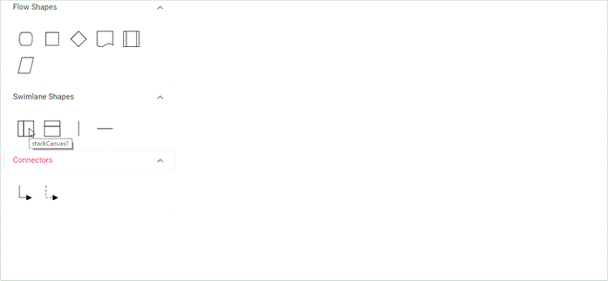

# Swim lane in Angular Diagram component

Swimlane is a type of diagram nodes,which is typically used to visualize the relationship between a business process and the department responsible for it by focusing on the logical relationships between activities.

## Create a swimlane

To create a swimlane,the type of shape should be set as [`swimlane`](https://ej2.syncfusion.com/angular/documentation/api/diagram/swimLaneModel).By Default swimlane's are arranged vertically.

The following code example illustrates how to define a swimlane object.












  


### Headers

Header was the primary element for swimlanes. The [`header`](https://ej2.syncfusion.com/angular/documentation/api/diagram/headerModel) property of swimlane allows you to define its textual description and to customize its appearance.

>Note: By using this header,the swimlane interaction will be performed,like selection, dragging,etc.

The following code example illustrates how to define a swimlane header.












  


### Customization of headers

The height and width of swimlane header can be customized with [`weight`](https://ej2.syncfusion.com/angular/documentation/api/diagram/headerModel#width) and [`height`](https://ej2.syncfusion.com/angular/documentation/api/diagram/headerModel#height) properties of swimlane header. set fill color of header by using the [`style`](https://ej2.syncfusion.com/angular/documentation/api/diagram/headerModel#style) property. The orientation of swimlane can be customized with the [`orientation`](https://ej2.syncfusion.com/angular/documentation/api/diagram/swimLaneModel#header) property of the header.

>Note: By default the swimlane orientation has Horizontal.

The following code example illustrates how to customize the swimlane header.












  


### Dynamic customization of swimlane header

 You can customize the swimlane header style and text properties dynamically. The following code illustrates how to dynamically customize the lane header.

 










  


### Header editing

Diagram provides the support to edit swimlane headers at runtime. We achieve the header editing by double click event. Double clicking the header label will enables the editing of that.
The following image illustrates how to edit the swimlane header.

## Lanes

Lane is a functional unit or a responsible department of a business process that helps to map a  process within the functional unit or in between other functional units.

The number of [`lanes`](https://ej2.syncfusion.com/angular/documentation/api/diagram/laneModel) can be added to swimlane. The lanes are automatically stacked inside  swimlane based on the order they are added.

### Create an empty lane

* The lane `id` is used to define the name of the lane and its further used to find the lane at runtime and do any customization.

* We can provide additional information to the lane by using the [`addInfo`](https://ej2.syncfusion.com/angular/documentation/api/diagram/laneModel#addInfo) property of the lane.

The following code example illustrates how to define a swimlane with lane.












  


### Create lane header

* The [`header`](https://ej2.syncfusion.com/angular/documentation/api/diagram/laneModel#header) property of lane allows you to textually describe the lane and to customize the appearance of the description.

The following code example illustrates how to define a lane header.












  


### Customizing lane header

* The size of lane can be controlled by using [`width`](https://ej2.syncfusion.com/angular/documentation/api/diagram/headerModel#width) and [`height`](https://ej2.syncfusion.com/angular/documentation/api/diagram/headerModel#height) properties of lane.
* The appearance of lane can be set by using the [`style`](https://ej2.syncfusion.com/angular/documentation/api/diagram/headerModel#style) properties.

The following code example illustrates how to customize the lane header.












  


### Dynamic customization of lane header

 We can customize the lane header style and text properties dynamically. The following code illustrates how to dynamically customize the lane header..











  


### Add lane at runtime

You can add the a lane at runtime by using the client side API method called `addLanes`. The following code illustrates how to dynamically add lane to swimlane.












  


### Add children to lane

To add nodes to lane,you should add [`children`](https://ej2.syncfusion.com/angular/documentation/api/diagram/laneModel#children) collection of the lane.

The following code example illustrates how to add nodes to lane.












  


### Lane interaction

### Resizing lane

* Lane can be resized in the bottom and left direction.
* Lane can be resized by using resize selector of the lane.
* Once you can resize the lane,the swimlane will be resized automatically.
* The lane can be resized either resizing the selector or the tight bounds of the child object. If the child node   move to edge of the lane it can be automatically resized.

The following image illustrates how resize the lane.

### Lane swapping

* Lanes can be swapped using drag the lanes over another lane.
* Helper should intimate the insertion point while lane swapping.

 The following image illustrates how swapping the lane.

### Disable Swimlane Lane swapping

You can disable swimlane lane swapping by using the property called `canMove`.

The following code illustrates how to disable swimlane lane swapping.












  


### Resize helper

* The special resize helper will be used to resize the lanes.
* The resize cursor will be available on the left and bottom direction alone.
* Once resize the lane the swimlane will be resized automatically.

### Children interaction in lanes

* You can resize the child node within swimlanes.
* You can drag the child nodes within lane.
* Interchange the child nodes from one lane to another lane.
* Drag and drop the child nodes from lane to diagram.
* Drag and drop the child nodes from diagram to lane.
* Based on the child node interactions,the lane size should be updated.

The following image illustrates children interaction in lane.

  
### Lane header editing

Diagram provides the support to edit Lane headers at runtime. We achieve the header editing by double click event. Double clicking the header label will enables the editing of that.
The following image illustrates how to edit the lane header.

## Phase

 Phase are the subprocess which will split each lanes as horizontally or vertically based on the swimlane orientation. The multiple number of [`Phase`](https://ej2.syncfusion.com/angular/documentation/api/diagram/phaseModel) can be added to swimlane.

The following code example illustrates how to add phase at swimlane.












  


### Dynamically add phase to lane

 You can add the a phase at runtime by using client side API method called `addPhases`. The following code example illustrates how to add phase at run time.












  


### Customizing phase

* The length of region can be set by using the  [`offset`](https://ej2.syncfusion.com/angular/documentation/api/diagram/phaseModel#offset) property of the phase.
* Every phase region can be textually described with the [`header`](https://ej2.syncfusion.com/angular/documentation/api/diagram/headerModel) property of the phase.
* You can increase the width of phase by using [`phaseSize`](https://ej2.syncfusion.com/angular/documentation/api/diagram/swimLaneModel#phasesize) property of swimlane.
* We can provide additional information to the phase by using the [`addInfo`](https://ej2.syncfusion.com/angular/documentation/api/diagram/phaseModel#addInfo) property of the phase.

The following code example illustrates how to customize the phase in swimlane.












  


### Phase interaction

### Resizing

* The phase can be resized by using its helper.
* You must select the phase header to enable the phase selection.
* Once the phase can be resized, the lane size will be updated automatically.

### Resizing helper

* The special resize helper will be used to resize the phase.
* The resize cursor will be available on the left and bottom direction for horizontal, and the top and bottom direction for vertical swimlane.

### Phase header editing

Diagram provides the support to edit phase headers at runtime. We achieve the header editing by double click event. Double clicking the header label will enables the editing of that.
The following image illustrates how to edit the swimlane header.

## Add swimlane to palette

   Diagram provides the support to add swimlane and phases to symbol palette. The following code sample illustrate how to add swimlane and phases to palette.












  


### Drag and drop swimlane to palette

* The drag and drop support for swimlane shapes has been provided.
* When you drag and drop the lane shape,if the diagram already contains swimlane with the same orientation, the lane will be added and stacked inside a swimlane based on the order. Otherwise, it will be added a new swimlane.
* The phase will only drop on swimlane shape with same orientation.

The following image illustrates how to drag symbol from palette.

## Limitations

* Connectors cannot be canceled when added directly to swimlane. we must initialize the connector through connector collection.
* We cannot edit the phase line style.