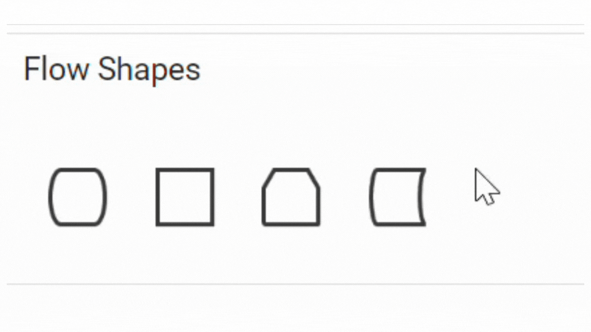
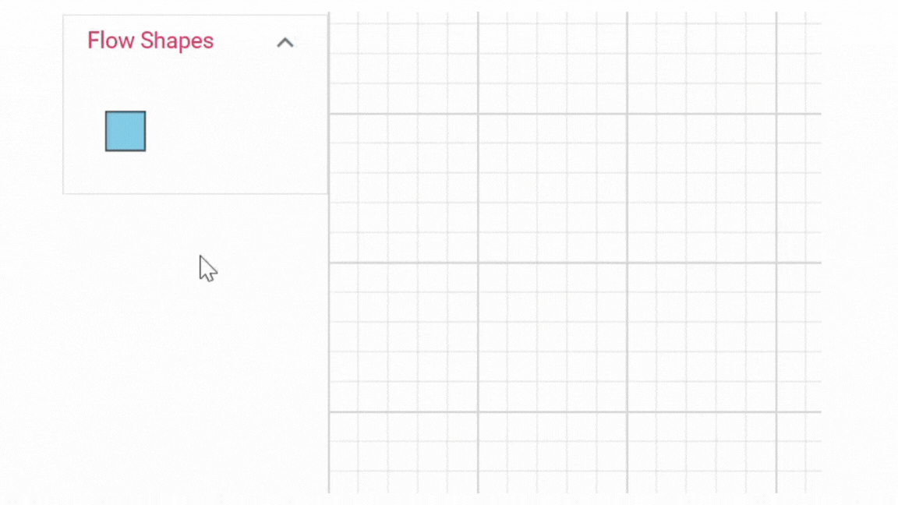

# Symbol palette in Angular Diagram component

The **SymbolPalette** displays a collection of palettes. The palette shows a set of nodes and connectors. It allows to drag and drop the nodes and connectors into the diagram.

## Create symbol palette

The [`width`](https://ej2.syncfusion.com/angular/documentation/api/diagram/palette#width-number) and [`height`](https://ej2.syncfusion.com/angular/documentation/api/diagram/palette#height-number) properties of the symbol palette allows to define the size of the symbol palette.

```typescript
@Component({
    selector: "app-container",
    template: `<ejs-symbolpalette id="symbolpalette"width="100%" height="700px">
    </ejs-symbolpalette>`,
    encapsulation: ViewEncapsulation.None
})
export class AppComponent {}
```

## Add palettes to SymbolPalette

A palette allows to display a group of related symbols and it textually annotates the group with its header. A [`Palettes`](https://ej2.syncfusion.com/angular/documentation/api/diagram/palette#palettes-PaletteModel[]) can be added as a collection of symbol groups.

The collection of predefined symbols can be added in palettes using the [`symbols`](https://ej2.syncfusion.com/angular/documentation/api/diagram/palette#symbols-[]) property.

To initialize a palette, define a JSON object with the property [`ID`](https://ej2.syncfusion.com/angular/documentation/api/diagram/palette#id-string) that is unique ID is set to the palettes.

The [`allowDrag`](https://ej2.syncfusion.com/angular/documentation/api/symbol-palette#allowdrag) property allows the user to drag the symbol from the symbol palette.

The following code example illustrates how to define a palette and how its added to symbol palette.












  


## Customize the palette header

Palettes can be annotated with its header texts.

The [`title`](https://ej2.syncfusion.com/angular/documentation/api/diagram/palette#title-string) displayed as the header text of palette.

The [`expanded`](https://ej2.syncfusion.com/angular/documentation/api/diagram/palette#expanded-boolean) property of palette allows to expand/collapse its palette items.

The [`height`](https://ej2.syncfusion.com/angular/documentation/api/diagram/palette#height-number) property of palette sets the height of the symbol group.

The [`iconCss`](https://ej2.syncfusion.com/angular/documentation/api/diagram/palette#iconCss-string) property sets the content of the symbol group.

The [`description`](https://ej2.syncfusion.com/angular/documentation/api/diagram/symbolDescription#description) defines the text to be displayed and how that is to be handled in `getSymbolInfo`.

Also, any HTML element into a palette header can be embedded by defining the getSymbolInfo property.

The following code example illustrates how to customize palette headers.












  


## Restrict expansion of the palette panel

The symbol palette panel can be restricted from getting expanded. The `cancel` argument of the `paletteExpanding` property defines whether the palette's panel should be expanded or collapsed. By default, the panel is expanded. This restriction can be done for each of the palettes in the symbol palette as desired.

In the following code example, the basic shapes palette is restricted from getting collapsed whereas the swimlane shapes palette can be expanded or collapsed.












  


## Stretch the symbols into the palette

The [`fit`](https://ej2.syncfusion.com/angular/documentation/api/diagram/symbolInfo#fit-boolean) property defines whether the symbol has to be fit inside the size, that is defined by the symbol palette. For example, when you resize the rectangle in the symbol, ratio of the rectangle size has to be maintained rather changing into square shape. The following code example illustrates how to customize the symbol size.












  


## Add/Remove symbols to palette at runtime

* Symbols can be added to palette at runtime by using public method, [`addPaletteItem`](https://ej2.syncfusion.com/angular/documentation/api/symbol-palette/#addpaletteitem).

* Symbols can be removed from palette at runtime by using public method, [`removePaletteItem`](https://ej2.syncfusion.com/angular/documentation/api/symbol-palette/#removepaletteitem).

## Customize the size of symbols

The size of the individual symbol can be customized. The [`symbolWidth`](https://ej2.syncfusion.com/angular/documentation/api/diagram/symbolPaletteModel/#symbolwidth) and  [`symbolHeight`](https://ej2.syncfusion.com/angular/documentation/api/diagram/symbolPaletteModel/#symbolheight) properties of node enables you to define the size of the symbols. The following code example illustrates how to change the size of a symbol.












  


The [`symbolMargin`](https://ej2.syncfusion.com/angular/documentation/api/diagram/symbolPaletteModel/#symbolmargin) property is used to create the space around elements, outside of any defined borders.

## Symbol preview

The symbol preview size of the palette items can be customized using [`symbolPreview`](https://ej2.syncfusion.com/angular/documentation/api/diagram/symbolPreview).
The [`width`](https://ej2.syncfusion.com/angular/documentation/api/diagram/symbolPreview#width-number) and [`height`](https://ej2.syncfusion.com/angular/documentation/api/diagram/symbolPreview#height-number) properties of SymbolPalette enables you to define the preview size to all the symbol palette items. The [`offset`](https://ej2.syncfusion.com/angular/documentation/api/diagram/symbolPreview#offset-PointModel) of the dragging helper relative to the mouse cursor.

The following code example illustrates how to change the preview size of a palette item.












  


## Default settings

While adding more number of symbols such as nodes and connectors to the palette, define the default settings for those objects through the [`getNodeDefaults`](https://ej2.syncfusion.com/angular/documentation/api/diagram/symbolPaletteModel/#getnodedefaults) and the [`getConnectorDefaults`](https://ej2.syncfusion.com/angular/documentation/api/diagram/symbolPaletteModel/#getconnectordefaults) properties of diagram allows to define the default settings for nodes and connectors.












  


## Adding symbol description for symbols in the palette

The diagram provides support to add symbol description below each symbol of a palette. This descriptive representation of each symbol will enhance the details of the symbol visually. The height and width of the symbol description can also be set individually.

* The property `getSymbolInfo`, can be used to add the symbol description at runtime.

The following code is an example to set a symbol description for symbols in the palette.












  


## Tooltip for symbols in symbol palette

The Symbol palette supports displaying tooltips when mouse hovers over the symbols. You can customize the tooltip for each symbol in the symbol palette.

### Default tooltip for symbols

When hovering over symbols in the symbol palette, the default tooltip displays the symbol's ID.
Refer to the image below for an illustration of the tooltip behavior in the symbol palette.




### Custom tooltip for symbols

To customize the tooltips for symbols in the symbol palette, assign a custom tooltip to the 'Tooltip' content property of each symbol. Once you define the custom tooltip, enable the Tooltip constraints for each symbol, ensuring that the tooltips are displayed when users hover over them.

Here, the code provided below demonstrates how to define tooltip content to symbols within a symbol palette.












  



### How to provide different tooltip for Symbol palette and diagram elements.

Differentiate the tooltips between symbols in the symbol palette and dropped nodes by utilizing the dragEnter event. When a custom tooltip is defined for a symbol, it will be displayed for both the symbol and the dropped node in the diagram canvas.

However, to provide distinct tooltips for symbols in the palette and dropped nodes, capture the dragEnter event and assign specific tooltips dynamically.  

When a symbol is dragged from the symbol palette and enters the diagram canvas, the [`DragEnter`] [`IDragEnterEventArgs`](https://ej2.syncfusion.com/angular/documentation/api/diagram/iDragEnterEventArgs) event is triggered. Within this event, you can define a new tooltip for the dropped node. By assigning custom tooltip content to the Tooltip property of the node, you can provide a distinct tooltip that is specific to the dropped node.

The following image illustrates the differentiation of tooltips displayed in the Symbol Palette and the Diagram.




The following code snippet will demonstrate how to define two different tooltip for symbol in the symbol palette and dropped node in the diagram canvas.

```ts
//Initialize the Diagram
 let diagram: Diagram = new Diagram({
            width: '100%', height: '500px',
            connectors: connectors, nodes: nodes,
            //event to change tooltip content while dragging symbols into Diagram
            dragEnter: dragEnter,
        });
 diagram.appendTo('#diagram');

function dragEnter(args:IDragEnterEventArgs)
    {
        //enable tooltip connstraints for the dragged symbol
        args.dragItem.constraints = NodeConstraints.Default | NodeConstraints.Tooltip;

        //change the tooltip content of the dragged symbol
        args.dragItem.tooltip.content='This is Diagram Tooltip';
    }
```

## Palette interaction

Palette interaction notifies the element enter, leave, and dragging of the symbols into the diagram.

## DragEnter

[`DragEnter`] [`IDragEnterEventArgs`](https://ej2.syncfusion.com/angular/documentation/api/diagram/iDragEnterEventArgs) notifies, when the element enter into the diagram from symbol palette.

## DragLeave

[`DragLeave`] [`IDragLeaveEventArgs`](https://ej2.syncfusion.com/angular/documentation/api/diagram/iDragLeaveEventArgs) notifies, when the element leaves from  the diagram.

## DragOver

[`DragOver`] [`IDragOverEventArgs`](https://ej2.syncfusion.com/angular/documentation/api/diagram/iDragOverEventArgs) notifies, when an element drag over another diagram element.

>Note: The diagram provides support to cancel the drag and drop operation from the symbol palette to the diagram when the ESC key is pressed.

## See Also

* [How to add the symbol to the diagram](./nodes)