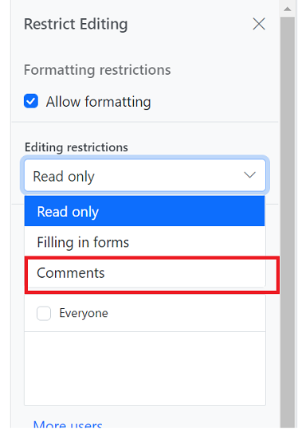

# Comments in Angular Document editor component

Document Editor allows you to add comments to documents. You can add, navigate and remove comments in code and from the UI.

## Add a new comment

Comments can be inserted to the selected text.

```typescript
this.documentEditor.editor.insertComment("Test comment");
```

## Comment navigation

Next and previous comments can be navigated using the below code snippet.

```typescript
//Navigate to next comment
this.documentEditor.selection.navigateNextComment();

//Navigate to previous comment
this.documentEditor.selection.navigatePreviousComment();
```

## Delete comment

Current comment can be be deleted using the below code snippet.

```typescript
this.documentEditor.editor.deleteComment();
```

## Delete all comment

All the comments in the document can be deleted using the below code snippet.

```typescript
this.documentEditor.editor.deleteAllComments();
```

## Protect the document in comments only mode

Document Editor provides support for protecting the document with `CommentsOnly` protection. In this protection, user allowed to add or edit comments alone in the document.

Document editor provides an option to protect and unprotect document using [`enforceProtection`](https://ej2.syncfusion.com/angular/documentation/api/document-editor/editor/#enforceprotection) and [`stopProtection`](https://ej2.syncfusion.com/angular/documentation/api/document-editor/editor/#stopprotection) API.

The following example code illustrates how to enforce and stop protection in Document editor container.

```typescript
import { Component, ViewEncapsulation, ViewChild } from '@angular/core';
import { DocumentEditorContainerComponent, ToolbarService } from '@syncfusion/ej2-angular-documenteditor';

@Component({
      selector: 'app-container',
      // specifies the template string for the Document Editor component
      template: `<div><button ejs-button (click)="protectDocument()" >Protect</button>
      <button ejs-button (click)="unProtectDocument()" >Unprotect</button>
      <ejs-documenteditorcontainer #document_editor serviceUrl="https://ej2services.syncfusion.com/production/web-services/api/documenteditor/" height="600px" style="display:block" [enableToolbar]=true> </ejs-documenteditorcontainer></div>`,
      encapsulation: ViewEncapsulation.None,
      providers: [ToolbarService]
})
export class AppComponent {
    @ViewChild('document_editor')
    public container: DocumentEditorContainerComponent;

    public protectDocument(): void {
        //enforce protection
        container.documentEditor.editor.enforceProtection('123', 'CommentsOnly');
    }

    public unProtectDocument(): void {
        //stop the document protection
        container.documentEditor.editor.stopProtection('123');
    }
}
```

Comment only protection can be enabled in UI by using [Restrict Editing pane](../document-editor/document-management#restrict-editing-pane/)



>Note: In enforce Protection method, first parameter denotes password and second parameter denotes protection type. Possible values of protection type are `NoProtection |ReadOnly |FormFieldsOnly |CommentsOnly`. In stop protection method, parameter denotes the password.