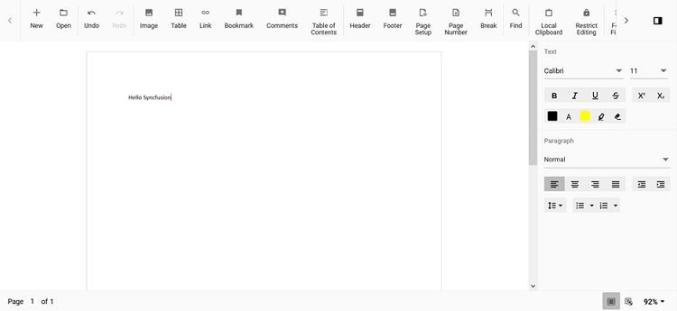

# Change the cursor color in document editor in Angular Document editor component

Document Editor default cursor color is black. The user can change the color by overriding the css property using class name. The Document editor cursor css have a class named `e-de-blink-cursor`.

Please refer the below code snippet to change the cursor color to red.

```css
.e-de-blink-cursor {
border-left: 1px solid red!important;
}
```

Output will be like below:


