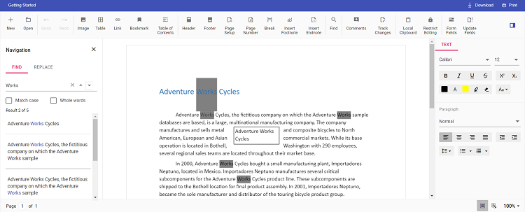

# Change the default search highlight color in Angular Document editor component

Document editor provides an options to change the default search highlight color using [`searchHighlightColor`](https://ej2.syncfusion.com/angular/documentation/api/document-editor/documentEditorSettingsModel/#searchhighlightcolor) in Document editor settings. The highlight color which is given in [`documentEditorSettings`](https://ej2.syncfusion.com/angular/documentation/api/document-editor-container/#documenteditorsettings) will be highlighted on the searched text. By default, search highlight color is `yellow`.

Similarly, you can use [`documentEditorSettings`](https://ej2.syncfusion.com/angular/documentation/api/document-editor#documenteditorsettings) property for DocumentEditor also.

The following example code illustrates how to change the default search highlight color.

```typescript
import { Component, OnInit } from '@angular/core';
import { ToolbarService } from '@syncfusion/ej2-angular-documenteditor';
@Component({
      selector: 'app-root',
      // specifies the template string for the DocumentEditorContainer component
      template: `<ejs-documenteditorcontainer serviceUrl="https://ej2services.syncfusion.com/production/web-services/api/documenteditor/" height="600px" style="display:block" [documentEditorSettings]= "searchHighlightColor" [enableToolbar]=true> </ejs-documenteditorcontainer>`,
      providers: [ToolbarService],
})
export class AppComponent implements OnInit {
    // Add required color to change the default search highlight color
    public searchHighlightColor = { searchHighlightColor: 'Grey' };
    ngOnInit(): void {}
}
```

Output will be like below:

