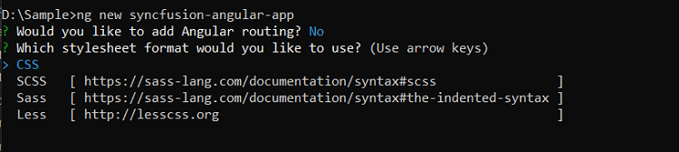
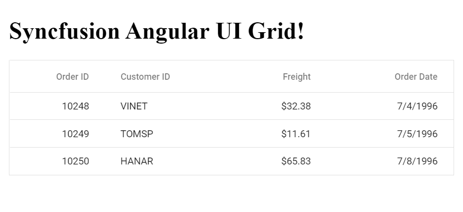

# Getting Started with Angular CLI

The Angular CLI is a command-line interface tool that allows developers to create, manage, and build Angular applications. This makes it easy to set up a new Angular project and get started with development.

In this guide, we will show you how to create an Angular project and install the Syncfusion Angular UI Components (Essential JS 2) to get started with development.

## Prerequisites

[System requirements for Syncfusion Angular UI components](../system-requirement/)

## Setting up an Angular project

Using [Angular CLI](https://github.com/angular/angular-cli), you can easily setup Angular projects. Install the Angular CLI tool globally in your machine.

```bash
npm install -g @angular/cli
```

## Create a new application

Once the Angular CLI is installed, you can use it to create a new Angular project by running the following command:

```bash
ng new syncfusion-angular-app
```

This command will prompt you for a few settings for the new project, such as whether to add Angular routing and which stylesheet format to use.



By default, it will create a CSS-based application. You can specify that you want to use SCSS by running the following command instead:

```bash
ng new syncfusion-angular-app --style=scss
```

Next, navigate to the created project folder:

```bash
cd syncfusion-angular-app
```

## Installing Syncfusion Angular packages

Syncfusion packages are distributed in npm under the `@syncfusion` scope. You can obtain all of the available Angular Syncfusion packages from [npm]( https://www.npmjs.com/search?q=%40syncfusion%2Fej2-angular- ).

Currently, Syncfusion provides two set of package structures for Angular components,

1. Ivy library distribution package [format](https://angular.io/guide/angular-package-format#angular-package-format)
2. Angular compatibility compiler (Angular’s legacy compilation and rendering pipeline) package.

Syncfusion's latest Angular packages are Ivy-distributed and compatible with Angular 12 and above. To install the package use the following command,

```bash
ng add @syncfusion/ej2-angular-grids
```
If you are not using fully ivy compiler application, use the `ngcc` tagged packages of the Syncfusion Angular components.

> These ngcc packages still works on the latest Angular Cli but throw some warning to use IVY compiled package.

```bash
npm add @syncfusion/ej2-angular-grids@20.2.38-ngcc
```

The above command does the following configuration to your Angular app,
 
 * Adds `@syncfusion/ej2-angular-grids` package and its peer dependencies to your `package.json` file.
 * Imports the `GridModule` in your application module `app.module.ts`.
 * Registers the Syncfusion UI default theme (material) in the `angular.json` file.
 
 This makes it easy to add the Syncfusion Angular Grids module to your project and start using it in your application.

 For more information about version compatibility, see [version compatibility](../upgrade/version-compatibility/).

 ## Adding Syncfusion Angular components

To use Syncfusion Angular components in your application, you will need to add them to your template and specify their properties in your component class.

In `src/app/app.component.ts`, you can use column directives with the `<ejs-grid>` selector and specify the `e-column` elements inside the `<ejs-grid>` element in the template for your component. The `e-column` element allows you to define the properties of a column in the Grid, such as its field name, header text, and data type.

```typescript
import { Component } from '@angular/core';

@Component({
  selector: 'app-root',
  template: `
  <h1>
    Syncfusion Angular UI Grid!
  </h1>

  <ejs-grid [dataSource]='data'>
    <e-columns>
      <e-column field='OrderID' headerText='Order ID' textAlign='Right' width=90></e-column>
      <e-column field='CustomerID' headerText='Customer ID' width=120></e-column>
      <e-column field='Freight' headerText='Freight' textAlign='Right' format='C2' width=90></e-column>
      <e-column field='OrderDate' headerText='Order Date' textAlign='Right' format='yMd' width=120></e-column>
    </e-columns>
  </ejs-grid>
 `
 })
export class AppComponent {
  public data: Object[] = [
    {
      OrderID: 10248, CustomerID: 'VINET', EmployeeID: 5, OrderDate: new Date(8364186e5),
      ShipName: 'Vins et alcools Chevalier', ShipCity: 'Reims', ShipAddress: '59 rue de l Abbaye',
      ShipRegion: 'CJ', ShipPostalCode: '51100', ShipCountry: 'France', Freight: 32.38, Verified: !0
    },
    {
      OrderID: 10249, CustomerID: 'TOMSP', EmployeeID: 6, OrderDate: new Date(836505e6),
      ShipName: 'Toms Spezialitäten', ShipCity: 'Münster', ShipAddress: 'Luisenstr. 48',
      ShipRegion: 'CJ', ShipPostalCode: '44087', ShipCountry: 'Germany', Freight: 11.61, Verified: !1
    },
    {
      OrderID: 10250, CustomerID: 'HANAR', EmployeeID: 4, OrderDate: new Date(8367642e5),
      ShipName: 'Hanari Carnes', ShipCity: 'Rio de Janeiro', ShipAddress: 'Rua do Paço, 67',
      ShipRegion: 'RJ', ShipPostalCode: '05454-876', ShipCountry: 'Brazil', Freight: 65.83, Verified: !0
    }
  ];
}
```
This will add a Grid to your application with the specified columns and data.

## Run the application

Run the `ng serve` command in the console, it will serve your application and you can open the browser window.



Refer the below sample for more information.












  


>Note: If you see a license banner when running your application, it means that you need to obtain a license key and register it within the application in order to use Syncfusion components. You can find more information on how to obtain and register a license key on our [Licensing overview](../licensing/overview/) page.

You can also refer below video to get start Syncfusion Angular Grid component.



## Syncfusion components-based styles

By default, the `Material` theme is registered in the `styles.css` file when you run the `ng add` command. However, Syncfusion Angular components offer a range of built-in [themes](../appearance/theme-studio/) that you can easily add to your project by importing the relevant theme.

 The default `Material` theme includes styles for all Syncfusion Angular components. If you only want to use the styles for specific Syncfusion components, you can import only the required dependencies. For example, to use the styles for the Grid component alone, you can import the required dependencies as shown in the following snippet,

```css
@import '../node_modules/@syncfusion/ej2-base/styles/material.css';  
@import '../node_modules/@syncfusion/ej2-buttons/styles/material.css';  
@import '../node_modules/@syncfusion/ej2-calendars/styles/material.css';  
@import '../node_modules/@syncfusion/ej2-dropdowns/styles/material.css';  
@import '../node_modules/@syncfusion/ej2-inputs/styles/material.css';  
@import '../node_modules/@syncfusion/ej2-navigations/styles/material.css';
@import '../node_modules/@syncfusion/ej2-popups/styles/material.css';
@import '../node_modules/@syncfusion/ej2-splitbuttons/styles/material.css';  
@import '../node_modules/@syncfusion/ej2-angular-grids/styles/material.css';
```

For information on using SCSS styles, see [here](../common/how-to/sass/).

## Adding feature Modules to Syncfusion Angular components

Syncfusion Angular components offer module-based services and are easy to import and extend the functionalities of the components. If you want to enable features such as paging, filtering, and sorting in a Grid that has been rendered in your application, you will need to include the corresponding service modules in the `providers` array of your modules.


```typescript
import { NgModule } from '@angular/core';
import { BrowserModule } from '@angular/platform-browser';
import { GridModule } from '@syncfusion/ej2-angular-grids';
// Imports Grid services from Syncfusion Angular Grids
import { PageService, FilterService, SortService } from '@syncfusion/ej2-angular-grids';
import { AppComponent } from './app.component';

/**
 * Module
 */
@NgModule({
    imports: [
        BrowserModule,
        GridModule
    ],
    declarations: [AppComponent],
    bootstrap: [AppComponent],
    // Add feature Service in the provider
    providers: [PageService,
                SortService,
                FilterService]
})
export class AppModule { }
```

The component has several options set on the ejs-grid element, including allowPaging, allowSorting, and allowFiltering, which enable paging, sorting, and filtering features in the Grid, respectively. The pageSettings property is also set to specify the page size for the Grid. you can use the following code snippet in the app.component.ts file,

```typescript
import { Component, OnInit } from '@angular/core';
import { data } from './datasource';
import {PageSettingsModel } from '@syncfusion/ej2-angular-grids';
@Component({
    selector: 'app-root',
    template: `<ejs-grid 
               [dataSource]='data' 
               [allowPaging]="true" 
               [allowSorting]="true"
               [allowFiltering]="true" 
               [pageSettings]="pageSettings">
                <e-columns>
                    <e-column field='OrderID' headerText='Order ID' textAlign='Right' width=90></e-column>
                    <e-column field='CustomerID' headerText='Customer ID' width=120></e-column>
                    <e-column field='Freight' headerText='Freight' textAlign='Right' format='C2' width=90></e-column>
                    <e-column field='OrderDate' headerText='Order Date' textAlign='Right' format='yMd' width=120></e-column>
                </e-columns>
                </ejs-grid>`
})
export class AppComponent implements OnInit {
    public data: object[];
    public pageSettings: PageSettingsModel;
    ngOnInit(): void {
        this.data = data;
        // The pageSettings property is also set to specify the page size for the Grid
        this.pageSettings = { pageSize: 6 };
    }
}
```












  


By using the Syncfusion Angular Grid component, you can easily add a robust data Grid to your Angular application that supports paging and sorting of data. For more details refer [Syncfusion Angular Grid](../grid/getting-started/).

## Syncfusion Angular components showcase samples

Syncfusion has a collection of sample applications that demonstrate the use of Syncfusion Angular UI components.

* [Expense Tracker](https://ej2.syncfusion.com/showcase/angular/expensetracker/#/dashboard)
* [Diagram Builder](https://ej2.syncfusion.com/showcase/angular/diagrambuilder/#/home)
* [Web mail](https://ej2.syncfusion.com/showcase/angular/webmail/#/home)
* [Appointment Planner](https://ej2.syncfusion.com/showcase/angular/appointmentplanner/#/dashboard)
* [Stock Chart](https://ej2.syncfusion.com/showcase/angular/stockchart/#/stockChart)

## See also

* [Upgradation Guide](../upgradation/upgrading-syncfusion/)
