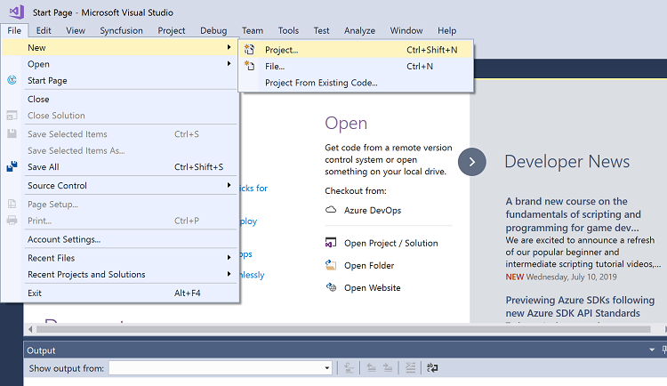

# Getting Started ASP .NET Core with Angular using Project Template

This document helps you to create a simple ASP .NET Core application with Angular Framework and Syncfusion Angular UI components.

## Prerequisites

Before getting started with Syncfusion Angular Components in ASP.NET Core with Angular project, check whether the following are installed in the developer machine. 

* Angular Versions supported - 6+
* Typescript Versions supported - 2.6+
* .NET CLI 2.0+

## Create an Application

Create a new project with project template.

1. Choose File > New > Project in the Visual Studio menu bar.



2. Select Installed > Visual C# > .NET Core and choose the required .NET Framework in the drop-down.

3. Select ASP.NET Core Web Application and change the application name, and then click OK.


4. Select Angular and then click OK. The application is created.


## Installing Syncfusion Button Package

Move to the Client-App folder to install the Syncfusion package.

```bash

cd ClientApp
npm install

```

Syncfusion packages are distributed in npm as @syncfusion scoped packages. You can get all the angular Syncfusion packages from the npm [link]( https://www.npmjs.com/search?q=%40syncfusion%2Fej2-angular- ).

Add the syncfusion angular packages to the application which needs to be run. For example we have add the syncfusion angular grid packages to the application.

```bash
npm install @syncfusion/ej2-angular-grids --save
(or)
npm I @syncfusion/ej2-angular-grids --save
```

## Adding Grid Module

After installing the package, the component modules are available to configure into your application from Syncfusion installed package. Syncfusion Angular package provides two different types of ng-Modules.

Refer to [`Ng Module`](../common/ng-module.html) to learn about `ngModules`.

Refer to the following code snippet to import the button module in app.module.ts from the `@syncfusion/ej2-angular-grids`.

```typescript
import { BrowserModule } from '@angular/platform-browser';
import { NgModule } from '@angular/core';
import { FormsModule } from '@angular/forms';
import { HttpModule } from '@angular/http';

import { AppComponent } from './app.component';

// Imported Syncfusion grid module from grids package
import { GridModule } from '@syncfusion/ej2-angular-grids';

@NgModule({
  declarations: [
    AppComponent
  ],
  imports: [
    BrowserModule,
    FormsModule,
    HttpModule,

    //Registering EJ2 grid module
    GridModule
  ],
  providers: [],
  bootstrap: [AppComponent]
})
export class AppModule { }
```

## Adding Syncfusion Component

Add the grid component snippet in `app.component.ts` as follows.

```typescript

import { Component, OnInit } from '@angular/core';
import { data } from './datasource';

@component({
selector: 'app-root',
template: `<ejs-grid [dataSource]='data'>
                <e-columns>
                    <e-column field='OrderID' headerText='Order ID' textAlign='Right' width=90></e-column>
                    <e-column field='CustomerID' headerText='Customer ID' width=120></e-column>
                    <e-column field='Freight' headerText='Freight' textAlign='Right' format='C2' width=90></e-column>
                    <e-column field='OrderDate' headerText='Order Date' textAlign='Right' format='yMd' width=120></e-column>
                </e-columns>
                </ejs-grid>`,
 })
export class AppComponent implements OnInit {
  public data: object[];
  ngOnInit(): void {
    this.data = data;
  }
}

```

## Adding CSS Reference

Add Grid component styles as given in the `styles.css` file.

``` css
@import '../node_modules/@syncfusion/ej2-base/styles/material.css';
@import '../node_modules/@syncfusion/ej2-buttons/styles/material.css';
@import '../node_modules/@syncfusion/ej2-calendars/styles/material.css';
@import '../node_modules/@syncfusion/ej2-dropdowns/styles/material.css';
@import '../node_modules/@syncfusion/ej2-inputs/styles/material.css';
@import '../node_modules/@syncfusion/ej2-navigations/styles/material.css';
@import '../node_modules/@syncfusion/ej2-popups/styles/material.css';
@import '../node_modules/@syncfusion/ej2-splitbuttons/styles/material.css';
@import '../node_modules/@syncfusion/ej2-angular-grids/styles/material.css';

```

## Run the Application

After adding the syncfusion component, run this application. The component will be render.

>Note: For your convenience, we have prepared an [ASP .NET Core and Angular Sample](https://github.com/SyncfusionExamples/ASP-.NET-Core-with-Angular-using-EJ2-controls)

## See Also

* [Microsoft Angular Project Template](https://www.telerik.com/kendo-angular-ui/components/installation/dotnet-core/)

* [Getting started with angular CLI](../getting-started/angular-cli/)
