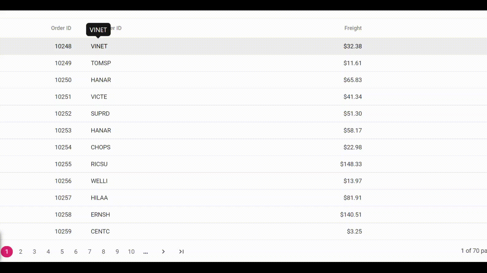

# Cell in Angular Grid component

## Displaying the HTML content

Displaying HTML content in a Grid can be useful in scenarios where you want to display formatted content, such as images, links, or tables, in a tabular format. Grid component allows you to display HTML tags in the Grid header and content. By default, the HTML content is encoded to prevent potential security vulnerabilities. However, you can enable the [disableHtmlEncode](https://ej2.syncfusion.com/angular/documentation/api/grid/column/#disablehtmlencode) property by setting the value as false to display HTML tags without encoding. This feature is useful when you want to display HTML content in a grid cell.

In the following example, the [EJ2 Toggle Switch Button](https://ej2.syncfusion.com/angular/documentation/switch/getting-started) component is added  to enable and disable the [disableHtmlEncode](https://ej2.syncfusion.com/angular/documentation/api/grid/column/#disablehtmlencode) property. When the switch is toggled, the [change](https://ej2.syncfusion.com/angular/documentation/api/switch/#change) event is triggered and the `disableHtmlEncode` property of the column is updated accordingly. The [refresh](https://ej2.syncfusion.com/angular/documentation/api/grid/#refresh) method is called to refresh the grid and display the updated content.












  


> * The [disableHtmlEncode](https://ej2.syncfusion.com/angular/documentation/api/grid/column/#disablehtmlencode) property disables HTML encoding for the corresponding column in the grid. 
> * If the property is set to **true**, any HTML tags in the column's data will be displayed. 
> * If the property is set to **false**, the HTML tags will be removed and displayed as plain text.
> * Disabling HTML encoding can potentially introduce security vulnerabilities, so use caution when enabling this feature.
> * If [enablehtmlsanitizer](https://ej2.syncfusion.com/angular/documentation/api/grid/#enablehtmlsanitizer) property of grid is set to true, then the content is sanitized to prevent any potential security vulnerabilities.
> * You can also disable the `disableHtmlEncode` property of the column using [getColumns](https://ej2.syncfusion.com/angular/documentation/api/grid#getcolumns) method on [change](https://ej2.syncfusion.com/angular/documentation/api/switch/#change) event of Switch component.This is demonstrated in the below code snippet, 

```typescript
change(args) {
  if (args.checked) {
    this.grid.getColumns()[1].disableHtmlEncode = false;
  } else {
    this.grid.getColumns()[1].disableHtmlEncode = true;
  }
  this.grid.refresh();
}
```

## Autowrap the grid content

The auto wrap feature allows the cell content in the grid to wrap to the next line when it exceeds the boundary of the specified cell width. The cell content wrapping works based on the position of white space between words. To support the Autowrap functionality in Syncfusion Grid, you should set the appropriate [width](https://ej2.syncfusion.com/angular/documentation/api/grid/column/#width) for the columns. The column width defines the maximum width of a column and helps to wrap the content automatically.

To enable auto wrap, set the [allowTextWrap](https://ej2.syncfusion.com/angular/documentation/api/grid/#allowtextwrap) property to **true**. You can also configure the wrap mode by setting the [textWrapSettings.wrapMode](https://ej2.syncfusion.com/angular/documentation/api/grid/textWrapSettings/#wrapmode) property.

Grid provides the below three options for configuring:

* **Both** - This is the default value for wrapMode. With this option, both the grid **Header** and **Content** text is wrapped.
* **Header** - With this option, only the grid header text is wrapped.
* **Content** - With this option, only the grid content is wrapped.

> * If a column width is not specified, then the Autowrap of columns will be adjusted with respect to the grid's width.
> * If a column's header text contains no white space, the text may not be wrapped.
> * If the content of a cell contains HTML tags, the Autowrap functionality may not work as expected. In such cases, you can use the [headerTemplate](https://ej2.syncfusion.com/angular/documentation/api/grid/column/#headertemplate) and [template](https://ej2.syncfusion.com/angular/documentation/api/grid/column/#template) properties of the column to customize the appearance of the header and cell content.

The following example demonstrates how to set the [allowTextWrap](https://ej2.syncfusion.com/angular/documentation/api/grid/#allowtextwrap) property to **true** and specify the wrap mode as **Content** by setting the [textWrapSettings.wrapMode](https://ej2.syncfusion.com/angular/documentation/api/grid/textWrapSettings/#wrapmode) property. Also change the `textWrapSettings.wrapMode` property to **Content** and **Both** on changing the dropdown value using the [change](https://helpej2.syncfusion.com/angular/documentation/api/drop-down-list/#change) event of the DropDownList component.












  


## Customize cell styles

Customizing the grid cell styles allows you to modify the appearance of cells in the Grid control to meet your design requirements. You can customize the font, background color, and other styles of the cells. To customize the cell styles in the grid, you can use grid event, css, property or method support.

### Using event

To customize the appearance of the grid cell, you can use the [queryCellInfo](https://ej2.syncfusion.com/angular/documentation/api/grid/#querycellinfo) event of the grid and you can access the [QueryCellInfoEventArgs](https://ej2.syncfusion.com/angular/documentation/api/grid/queryCellInfoEventArgs) object, which provides information about the cell such as row and column indexes, data, and cell element.This event is triggered for each cell in the grid when it is rendered. In the event handler, you can modify the cell's style based on the corresponding cell information like column indexes, data, cell element and etc.

The following example demonstrates how to add a [queryCellInfo](https://ej2.syncfusion.com/angular/documentation/api/grid/#querycellinfo) event handler to the grid. In the event handler, checked whether the current column is **Freight** field and then applied the appropriate CSS class to the cell based on its value.












  


> * The [queryCellInfo](https://ej2.syncfusion.com/angular/documentation/api/grid/#querycellinfo) event is triggered for every cell of the grid, so it may impact the performance of the grid whether used to modify a large number of cells.

### Using CSS

You can apply styles to the cells using CSS selectors. The Grid provides a class name for each cell element, which you can use to apply styles to that specific cell or cells in a particular column. The `e-rowcell` class is used to style the row cells, and the `e-selectionbackground` class is used to change the background color of the selected row.

```CSS
.e-grid td.e-cellselectionbackground {
  background-color: #235481;
  color: white;
  font-style: italic;
}
```

The following example demonstrates how to customize the appearance of a specific row in the grid on selection using `className`. 












  


### Using property

To customize the style of grid cells, define [customAttribute](https://ej2.syncfusion.com/angular/documentation/api/grid/column/#customattributes) property to the column definition object. The `customAttributes` property takes an object with the name-value pair to customize the CSS properties for grid cells. You can also set multiple CSS properties to the custom class using the customAttributes property.

```CSS
.custom-css {
  background: #d7f0f4;
  font-style: italic;
  color:navy
}
```
Here, setting the customAttributes property of the **ShipCity** column to an object that contains the CSS class 'custom-css'. This CSS class will be applied to all the cells in the **ShipCity** column of the grid.

```typescript
{
    field: 'ShipCity', headerText: 'Ship City', customAttributes: {class: 'custom-css'}, width: '120'
}
```
The following example demonstrates how to customize the appearance of the **OrderID** and **ShipCity** columns using custom attributes. 












  


> Custom attributes can be used to customize any cell in the grid, including header and footer cells.

### Using methods

The Grid provides below methods to customize the appearance of the grid columns header and cell:

1. [getHeaderContent](https://ej2.syncfusion.com/angular/documentation/api/grid/#getheadercontent): The `getHeaderContent` method is used to customize the appearance of the column header in the grid and accessing the header element using the `querySelector` method and applying the style using the style property of the cell element.

2. [getCellFromIndex](https://ej2.syncfusion.com/angular/documentation/api/grid/#getcellfromindex): The `getCellFromIndex` method is used to customize the appearance of a specific cell in the grid by specifying the index of the row and column for which you want to customize the appearance.

The following example demonstrates how to use [getColumnHeaderByIndex](https://ej2.syncfusion.com/angular/documentation/api/grid/#getcolumnheaderbyindex) and [getCellFromIndex](https://ej2.syncfusion.com/angular/documentation/api/grid/#getcellfromindex) methods to customize the appearance of the **CustomerID** column header and specific cell inside the [dataBound](https://ej2.syncfusion.com/angular/documentation/api/grid/#databound) event of the grid.












  


> Make sure to pass the correct row and column indices to [getCellFromIndex](https://ej2.syncfusion.com/angular/documentation/api/grid/#getcellfromindex) method, or else the appearance of the wrong cell might get customized.

## Clip Mode

The clip mode feature is useful when you have a long text or content in a grid cell, which overflows the cell's width or height. It provides options to display the overflow content by either truncating it, displaying an ellipsis or displaying an ellipsis with a tooltip. You can enable this feature by setting [columns.clipMode](https://ej2.syncfusion.com/angular/documentation/api/grid/column/#clipmode) property to one of the below available options.

There are three types of [clipMode](https://ej2.syncfusion.com/angular/documentation/api/grid/column/#clipmode) available:

* **Clip**: Truncates the cell content when it overflows its area.
* **Ellipsis**: Displays ellipsis when the cell content overflows its area.
* **EllipsisWithTooltip**: Displays ellipsis when the cell content overflows its area, also it will display the tooltip while hover on ellipsis is applied. Also it will display the tooltip while hover on ellipsis is applied.

The following example demonstrates, how to set the [clipMode](https://ej2.syncfusion.com/angular/documentation/api/grid/column/#clipmode) property to **Clip** for the **Name of the Inventor** column, **Ellipsis** for the **Number of Patent Families** column, and **EllipsisWithTooltip** for the **Main Fields of Invention** column, on changing the dropdown value using the [change](https://helpej2.syncfusion.com/angular/documentation/api/drop-down-list/#change) event of the DropDownList component.













  


> * By default, [columns.clipMode](https://ej2.syncfusion.com/angular/documentation/api/grid/column/#clipmode) value is **Ellipsis**.
> * If you set the [width](https://ej2.syncfusion.com/angular/documentation/api/grid/column/#width) property of a column, the clip mode feature will be automatically applied to that column if the content exceeds the specified width.
> * Be careful when using the Clip mode, as it may result in important information being cut off. It is generally recommended to use the Ellipsis or EllipsisWithTooltip modes instead.

## Tooltip

The Syncfusion Grid allows you to display information about the grid columns to the user when they hover over them with the mouse.

### Render bootstrap tooltip in grid cells

The Grid component allows rendering Bootstrap tooltips in the cells. To enable this feature, you need to add the Bootstrap CDN link and use the `ngAfterViewChecked` method to initialize the tooltip. 

This is demonstrated in the sample code below which shows how to enable Bootstrap tooltip for the **CustomerID** field using `ng-template` in grid cells,

Step 1: Install the Bootstrap and jQuery package in your application and add the script and style of the respective packages in the angular.json file,

```json

"styles": 
[
  "node_modules/bootstrap/dist/css/bootstrap.min.css",
  "src/styles.css",
  "node_modules/@syncfusion/ej2-material-theme/styles/material.css"
],
"scripts": ["node_modules/jquery/dist/jquery.min.js"]

```

Step 2: Add the CDN link of Boostrap in the index.html file. Place the `link` tag in the `head` for the CSS, and the `script` tag for the JavaScript bundle before the closing `body`. 

```html

<link href="https://cdn.jsdelivr.net/npm/bootstrap@5.3.0-alpha3/dist/css/bootstrap.min.css" rel="stylesheet" integrity="sha384-KK94CHFLLe+nY2dmCWGMq91rCGa5gtU4mk92HdvYe+M/SXH301p5ILy+dN9+nJOZ" crossorigin="anonymous">
<script src="https://cdn.jsdelivr.net/npm/bootstrap@5.3.0-alpha3/dist/js/bootstrap.bundle.min.js" integrity="sha384-ENjdO4Dr2bkBIFxQpeoTz1HIcje39Wm4jDKdf19U8gI4ddQ3GYNS7NTKfAdVQSZe" crossorigin="anonymous"></script>
<script src="https://cdn.jsdelivr.net/npm/@popperjs/core@2.11.7/dist/umd/popper.min.js" integrity="sha384-zYPOMqeu1DAVkHiLqWBUTcbYfZ8osu1Nd6Z89ify25QV9guujx43ITvfi12/QExE" crossorigin="anonymous"></script>
<script src="https://cdn.jsdelivr.net/npm/bootstrap@5.3.0-alpha3/dist/js/bootstrap.min.js" integrity="sha384-Y4oOpwW3duJdCWv5ly8SCFYWqFDsfob/3GkgExXKV4idmbt98QcxXYs9UoXAB7BZ" crossorigin="anonymous"></script>

```

Step 3: The following code demonstrates how to render Bootstrap tooltip for the **CustomerID** field with `ng-template` on grid cells using ngAfterViewChecked` method,

```typescript

import { AfterViewChecked, Component } from '@angular/core';
import { orderDataSource } from './data';
import 'bootstrap';
declare var $: any;
@Component({
  selector: 'app-root',
  template: `
  <div>
    <ejs-grid [dataSource]='data' [allowPaging]='true'>
      <e-columns>
        <e-column field='OrderID' headerText='Order ID' textAlign='Right' width=90></e-column>
        <e-column field='CustomerID' headerText='Customer ID' width=120>
        <ng-template #template let-data>
          <div class="row clearfix">
            <div class="col-md-2" style="text-align:right">
              <div
                data-toggle="tooltip"
                data-container="body"
                [title]="data.CustomerID"
                data-placement="left"
                data-delay='{"show":"800", "hide":"300"}'>
                <i class="fas fa-pencil-alt"></i>{{ data.CustomerID }}
              </div>
            </div>
          </div>
        </ng-template>
        </e-column>
        <e-column field='Freight' headerText='Freight' textAlign='Right' format='C2' width=90></e-column>
        <e-column field='OrderDate' headerText='Order Date' textAlign='Right' format='yMd' width=120></e-column>
      </e-columns>
    </ejs-grid>
 </div>`
})
export class AppComponent implements AfterViewChecked {
  public data = orderDataSource;

  ngAfterViewChecked() {
    $('[data-toggle="tooltip"]').tooltip();
  }

}

```

The following screenshot represents the Bootstrap tooltip for the **CustomerID** field,



> * The Bootstrap CDN link must be added to the HTML file.
> * The `ngAfterViewChecked` method is called after the component's view has been fully initialized, so it is a good place to initialize the Bootstrap tooltip.

### Display custom tooltip for columns

The Grid provides a feature to display custom tooltips for its columns using the [EJ2 Tooltip](https://ej2.syncfusion.com/angular/documentation/tooltip/getting-started) component. This allows you to provide additional information about the columns when the user hovers over them.

To enable custom tooltips for columns in the Grid, you can render the Grid control inside the Tooltip component and set the target as `.e-rowcell`. This will display the tooltip when hovering over the grid cells.

Change the tooltip content for the grid cells by using the following code in the [beforeRender](https://ej2.syncfusion.com/angular/documentation/api/tooltip/#beforerender) event.

```typescript
 beforeRender(args): void {
    if (args.target.classList.contains('e-rowcell')) {
        // event triggered before render the tooltip on target element.
        this.tooltip.content = 'This is value "' + args.target.innerText + '" ';
    }
  }

```

The following example demonstrates how to customize the tooltip content for the grid cells by using the [beforeRender](https://ej2.syncfusion.com/angular/documentation/api/tooltip/#beforerender) event of the EJ2 Tooltip component.












  


## Grid lines

The [gridLines](https://ej2.syncfusion.com/angular/documentation/api/grid/#gridlines) in a grid are used to separate the cells with horizontal and vertical lines for better readability. You can enable the grid lines by setting the [gridLines](https://ej2.syncfusion.com/angular/documentation/api/grid/#gridlines) property to one of the following values:

| Modes | Actions |
|-------|---------|
| Both | Displays both the horizontal and vertical grid lines.|
| None | No grid lines are displayed.|
| Horizontal | Displays the horizontal grid lines only.|
| Vertical | Displays the vertical grid lines only.|
| Default | Displays grid lines based on the theme.|

The following example demonstrates how to set the [gridLines](https://ej2.syncfusion.com/angular/documentation/api/grid/#gridlines) property based on changing the dropdown value using the [change](https://helpej2.syncfusion.com/angular/documentation/api/drop-down-list/#change) event of the DropDownList component.












  


>By default, the grid renders with **Default** mode.

## See Also

* [Is it possible to apply gradient color based on min and max value in Angular Grid?](https://www.syncfusion.com/forums/160346/is-it-possible-to-apply-gradient-color-based-on-min-and-max-value-in-angular-grid)
* [How to customize the header cell styles using methods](columns/headers#using-methods)