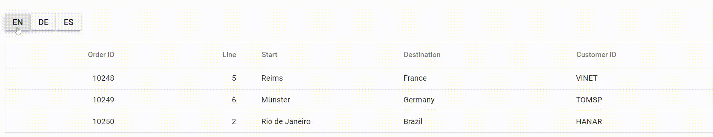
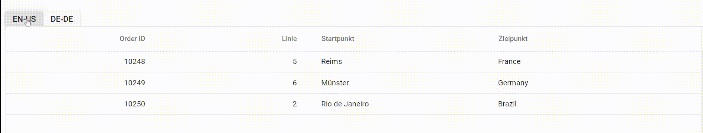

# Headers in Angular Grid component

## Header text

By default, the header text of a column in Grid is displayed from the column's [field](https://ej2.syncfusion.com/angular/documentation/api/grid/column/#field) value. However, you can easily override the default header title and provide a custom header text for the column using the [headerText](https://ej2.syncfusion.com/angular/documentation/api/grid/column/#headertext) property. 

To enable the `headerText` property, you simply need to define it in the **e-column** element. The following example demonstrates how to enable header text for a  Grid column.












  


>* The `headerText` property is optional, and if it is not defined, then the corresponding column's field value is set as header text for that column.  
>* You can also use the [headerTemplate](https://ej2.syncfusion.com/angular/documentation/api/grid/column/#headertemplate) property to apply custom HTML content to the header cell.

## Header template

The [headerTemplate](https://ej2.syncfusion.com/angular/documentation/api/grid/column/#headertemplate) property is used to customize the header element of a Grid column. With this property, you can render custom HTML elements or Angular components to the header element. This feature allows you to add more functionality to the header, such as sorting or filtering.

In this demo, the custom element is rendered for both **CustomerID** and **OrderDate** column headers.












  


>* The `headerTemplate` property is only applicable to Grid columns that have a header element.
>* You can use any HTML or Angular component in the header template to add additional functionality to the header element.

## Stacked header 

In Grid, you can group multiple levels of column headers by stacking the Grid columns. This feature allows you to organize the Grid columns in a more structured and understandable way. This can be achieved by setting the [columns->columns](https://ej2.syncfusion.com/documentation/api/grid/column/#columns) property. Within this property, you can define an array of column objects to group together as sub-headers under a main header. You can define the `headerText` property of each sub-header column to set the text for that sub-header.

You can customize the appearance of the stacked header elements by using the headerTemplate property. This property accepts an ng-template reference, which allows you to define custom HTML elements or Angular components to the header element. Here's an example of how to use stacked headers with a custom `headerTemplate` in Syncfusion Grid.












  


## Align the text of header text

You can horizontally align the text in column headers of the Grid component using the [headerTextAlign](https://ej2.syncfusion.com/angular/documentation/api/grid/column/#headertextalign) property. By default, the text is aligned to the left, but you can change the alignment by setting the value of the `headerTextAlign` property to one of the following options:

* **Left**: Aligns the text to the left (default).
* **Center**: Aligns the text to the center.
* **Right**: Aligns the text to the right.
* **Justify**: Header text is justified.

Here is an example of using the `headerTextAlign` property to align the text of a Grid column header:












  


>* The `headerTextAlign` property only changes the alignment of the text in the column header, and not the content of the column. If you want to align both the column header and content, you can use the [textAlign](https://ej2.syncfusion.com/documentation/api/grid/column/#textalign) property.
>* You can also use the `headerTextAlign` property with the stacked header feature in Syncfusion Grid. The property will align the header text in the sub-headers as well.

## Autowrap the header text

The autowrap allows the cell content of the grid to wrap to the next line when it exceeds the boundary of the specified cell width. The cell content wrapping works based on the position of white space between words. To support the Autowrap functionality in Syncfusion Grid, you should set the appropriate [width](https://ej2.syncfusion.com/angular/documentation/api/grid/column/#width) for the columns. The column width defines the maximum width of a column and helps to wrap the content automatically.

To enable autowrap, set the `allowTextWrap` property to **true**. You can also configure the auto wrap mode by setting the [textWrapSettings.wrapMode](https://ej2.syncfusion.com/angular/documentation/api/grid/textWrapSettings/#wrapmode) property.

Grid provides the below three options for configuring:

* **Both**: This is the default value for wrapMode. With this option, both the grid header text and content is wrapped.
* **Header**: With this option, only the grid header text is wrapped.
* **Content**: With this option, only the grid content is wrapped.

>* If a column width is not specified, then the Autowrap of columns will be adjusted with respect to the grid's width.
>* If a column's header text contains no white space, the text may not be wrapped.
>* If the content of a cell contains HTML tags, the Autowrap functionality may not work as expected. In such cases, you can use the [headerTemplate](https://ej2.syncfusion.com/angular/documentation/api/grid/column/#headertemplate) and [template](https://ej2.syncfusion.com/angular/documentation/api/grid/column/#template) properties of the column to customize the appearance of the header and cell content.

In the example below, the `textWrapSettings.wrapMode` property is set to **Header** only the grid header text is wrap to the next line.












  


## Change the height of header

Changing the height of the header can be useful in cases where the default height is not sufficient to display the header content cell. For example, if you have a header with a lot of text or if you want to add an image to the header, you may need to increase the height of the header to accommodate the content.This can be easily achieved by changing the height of the header using CSS or by dynamically adjusting the height using a methods.

**Using css**

You can use CSS to override the default height of the **.e-grid .e-headercell** class to change the height of the header. Here is an example code snippet:

```css
.e-grid .e-headercell {
  height: 130px;
}
```

**Using methods**

To change the height of the header dynamically, you can use the [getHeaderContent](https://ej2.syncfusion.com/angular/documentation/api/grid#getheadercontent) method to get the header content element of the Syncfusion Grid. Then, you can use the **querySelectorAll** method to get all the header cell elements with the class **e-headercell**. Finally, you can loop through each header cell element and set its style property to adjust the height.












  


>* You can also use the [getHeaderTable](https://ej2.syncfusion.com/angular/documentation/api/grid#getheadertable) method to get the table element of the header, and then adjust the height.
>* You cannot change the height of row below the default height of 42px using the **e-columnheader** class.

## Change header text dynamically

The Syncfusion Grid component provides a way to modify the header text of a corresponding column in real-time based on events or other events. This feature can be useful in various scenarios, such as displaying a custom header text for a specific column or updating the header text dynamically based on input. By allowing for dynamic changes to the header text, the Grid provides a more flexible and customizable experience.

**Using Event**

To modify the header text of a corresponding column dynamically, you can use the [headerCellInfo](https://ej2.syncfusion.com/angular/documentation/api/grid/#headercellinfo) event provided by the Syncfusion Grid. This event is triggered for each header cell element rendered in the Grid.

When the `headerCellInfo` event is triggered, it provides a **HeaderCellInfoEventArgs** object as a parameter. This object contains the following properties:

* **cell**: Defines the header cell that is being modified.
* **node**: Defines the DOM element of the header cell that is being modified.

You can use these properties to access and modify the header text of the corresponding column. Once the header text is modified, you can refresh the Grid to reflect the changes by calling the [refreshHeader](https://ej2.syncfusion.com/documentation/api/grid#refreshheader) method of the Grid.

**Using method**

The Grid component provides several methods that allow you to change the column header text dynamically. Here are some of the methods you can use:

1. [getColumnByField](https://ej2.syncfusion.com/angular/documentation/api/grid/#getcolumnbyfield): This method takes a field name as a parameter and returns the entire column object that corresponds to that field name, including properties such as headerText, width, and alignment. You can use this method to modify any aspect of the column.

2.	[getColumnHeaderByField](https://ej2.syncfusion.com/angular/documentation/api/grid/#getcolumnheaderbyfield): Retrieves the header element of a column based on its field name. You can modify the **textContent** property of the header element to change the header text. This method does not return a reference to the column object itself, only to the header element.

3.	[getColumnIndexByField](https://ej2.syncfusion.com/documentation/api/grid/#getcolumnindexbyfield): Retrieves the index of a column based on its field name. You can then use the `getColumnByIndex` method to retrieve the column object and modify its `headerText` property to change the header text.

4.	[getColumnByUid](https://ej2.syncfusion.com/angular/documentation/api/grid/#getcolumnbyuid): Retrieves the column object based on its unique identifier (UID). You can modify the `headerText` property of the column object to change the header text.

5.	[getColumnHeaderByIndex](https://ej2.syncfusion.com/angular/documentation/api/grid/#getcolumnheaderbyindex): Retrieves the header element of a column based on its zero-based index. You can modify the **textContent** property of the header element to change the header text. This method does not return a reference to the column object itself, only to the header element.

6.	[getColumnIndexByUid](https://ej2.syncfusion.com/angular/documentation/api/grid/#getcolumnindexbyuid): Retrieves the index of a column based on its unique identifier (UID). You can then use the `getColumnByIndex` method to retrieve the column object and modify its `headerText` property to change the header text.

7.	[getColumnHeaderByUid](https://ej2.syncfusion.com/angular/documentation/api/grid/#getcolumnheaderbyuid): Retrieves the header element of a column based on its unique identifier (UID). You can modify the **textContent** property of the  header element to change the header text. This method does not return a reference to the column object itself, only to the header element.If you only have an `ng-template` for the column header, and the column itself is not defined with a `field` , then you can use the `getColumnHeaderByUid` method to get a reference to the header element and modify its text content to change the header text.
	
>* When you change the header text dynamically, make sure to **refresh** the Grid to reflect the changes by calling the [refreshHeader](https://ej2.syncfusion.com/angular/documentation/api/grid/#refreshheader) method.
>* The UID is automatically generated by the Grid component and may change whenever the grid is refreshed or updated.

Here is an example of how to change the header text of a column using the `getColumnByField` method:












  


**Changing header text using headerValueAccessor property**

The `headerValueAccessor` property in Syncfusion Grid allows you to customize the text of a column header cell, which can be useful in scenarios where you want to change the text to display it in a different language, format or add additional information to the header. This property is triggered every time the header cell is rendered.

To enable the `headerValueAccessor` property, you need to set the [headerValueAccessor](https://ej2.syncfusion.com/angular/documentation/api/grid/headervalueaccessor/) property of the corresponding column. This property accepts a callback function that takes two arguments:

  * **field**: Represents the current field of the column.
  * **column**: Represents the current column object.

>* The `headerValueAccessor` property should only be used to change the text of the header and not to perform any DOM-oriented operations such as adding or manipulating DOM elements in the header. In such cases, you should use the [headerCellInfo](https://ej2.syncfusion.com/angular/documentation/api/grid/#headercellinfo) event instead.
>* The `headerValueAccessor` property is triggered every time the header cell is rendered or refreshed.
>* The callback function defined for the `headerValueAccessor` property should return a string that represents the new text of the column header.
>* If you only need to refresh the column header, you can dynamically change the header content using the [refreshHeader](https://ej2.syncfusion.com/angular/documentation/api/grid/#refreshheader) method.
>* You can use this property for individual columns or for all columns by adding it to the grid's properties.
  
Here's an example of how to use the `headerValueAccessor` property to change the header text of a column:












  


**Changing the header text of all columns**

If you want to change the header text of all columns in the grid, you can loop through the Columns collection of the grid and set the `headerText` property for each column. Here is an example:

 










  


## Change the orientation of header text

By default, the text in the column headers of the Syncfusion Grid control is oriented horizontally. However, in some cases, you may want to change the orientation of the header text to vertical, diagonal, or at a custom angle. This can be achieved by adding a custom CSS class to the column header cell using the [customAttributes](https://ej2.syncfusion.com/angular/documentation/api/grid/column/#customattributes) property of the Grid columns.

Follow the below steps to change the orientation of the header text in Grid:

**Step 1**: **Create a CSS class with orientation style for grid header cell**

To `rotate` the header text, you can create a CSS class with the `transform` property that rotates the header text 90 degrees. This class will be added to the header cell using the `customAttributes` property.

```css
.orientationcss .e-headercelldiv {
    transform: rotate(90deg);
}
```

**Step 2**: **Add the custom CSS class to the grid column**

Once you have created the CSS class, you can add it to the particular column by using the `customAttributes` property. This property allows you to add any custom  attribute to the grid column.

For example, to add the orientationcss class to the Freight column, you can use the following code:

```typescript
<e-column field='Freight' headerText='Freight' textAlign='Center' format='C2' [customAttributes]='customAttributes' width=80></e-column>
```

**Step 3**: **Resize the header cell height**

After adding the custom CSS class to a column, you need to resize the header cell height so that the rotated header text is fully visible. You can do this by using the following code:

```typescript
setHeaderHeight(args) {
    let textWidth: number = document.querySelector('.orientationcss > div').scrollWidth;//Obtain the width of the headerText content.
    let headerCell: NodeList = document.querySelectorAll('.e-headercell');
    for(let i: number = 0; i < headerCell.length; i++) {
        (<HTMLElement>headerCell.item(i)).style.height = textWidth + 'px'; //Assign the obtained textWidth as the height of the headerCell.
    }
}

```












  


## Translate header text using ngx-translate 

The ngx-translate library provides **internationalization (i18n)** and **localization (l10n)** support for Angular applications. With ngx-translate, you can easily translate your Angular application into multiple languages.

In the context of the Syncfusion Angular Grid component, you can use ngx-translate to translate the header text of the Grid's columns. There are two ways to achieve this: through header text and through header template.

### Through header text  

To translate the header text of the Grid's columns using **ngx-translate** through header text, you can use the **translate** pipe for the [headerText](https://ej2.syncfusion.com/angular/documentation/api/grid/column/#headertext) property.

**Step 1**: Create and Configure the TranslateService

````typescript

import { Component, ViewChild } from '@angular/core';
import { TranslateService } from '@ngx-translate/core';
import { GridComponent } from '@syncfusion/ej2-angular-grids';
@Component({
  selector: 'app-root',
  templateUrl: './app.component.html',
  styleUrls: ['./app.component.css'],
})
export class AppComponent {
  constructor(public translate: TranslateService) {
  }

  @ViewChild('grid', { static: true })
  public grid!: GridComponent;
  public flag: boolean = true;
  public data: Object[] = [];

  changeLanguage(lang: string) {
    this.translate.use(lang);

    setTimeout(() => {
      this.grid.refreshHeader();
    }, 500);
  }

  ngOnInit(): void {
    this.data = [
      {
        OrderID: 10248,
        CustomerID: 'VINET',
        lineId: 5,
        start: 'Reims',
        destination: 'France',
      },
      {
        OrderID: 10249,
        CustomerID: 'TOMSP',
        lineId: 6,
        start: 'Münster',
        destination: 'Germany',
      },
      {
        OrderID: 10250,
        CustomerID: 'HANAR',
        lineId: 2,
        start: 'Rio de Janeiro',
        destination: 'Brazil',
      },
    ];
  }
}

````

**Step 2**:  Use the translate pipe in your HTML code to translate the `headerText` of the column.

```html
<h1> Ngx translate pipe for header text in Angular Grid component</h1>
<h1></h1>
<div class="container-fluid py-3">
  <div class="btn-group btn-group-sm py-5">
    <button  ejs-button type="button" class="btn btn-sm btn-info"
     (click)="changeLanguage('en')">en</button>
    <button  ejs-button type="button" class="btn btn-sm btn-success"
    (click)="changeLanguage('de')">de</button>
    <button  ejs-button ejs-button type="button" ejs-button class="btn btn-sm btn-warning"
    (click)="changeLanguage('es-ES')">es</button>
  </div>
</div>
<div style="padding:20px 0px 0px 0px">
  <ejs-grid #grid [dataSource]="data" height="350">
    <e-columns>
      <e-column field="OrderID" headerText="Order ID" width="120" textAlign="Right"></e-column>
      <e-column field="lineId" headerText="{{ 'Line' | translate }}" width="120" textAlign="Right">
      </e-column>
      <e-column field="start" headerText="{{ 'Start' | translate }}" width="140">
      </e-column>
      <e-column field="destination" headerText="{{ 'Destination' | translate }}" width="170">
      </e-column>
    </e-columns>
  </ejs-grid>
<div>

```

**Step 3**: Import the **TranslateModule** and **TranslateLoader** in your app.module.ts file. You also need to import the `HttpClientModule` to enable HTTP requests for loading translation files.

```ts

import { NgModule } from '@angular/core';
import { BrowserModule } from '@angular/platform-browser';
import { HttpClient, HttpClientModule } from '@angular/common/http';
import { TranslateModule, TranslateLoader } from '@ngx-translate/core';
import { TranslateHttpLoader } from '@ngx-translate/http-loader';
import { AppComponent } from './app.component';
import { GridAllModule } from '@syncfusion/ej2-angular-grids';
import { CommonModule } from '@angular/common';
import { ButtonModule } from '@syncfusion/ej2-angular-buttons';

export function createTranslateLoader(http: HttpClient) {
  return new TranslateHttpLoader(http, './assets/i18n/', '.json');
}

@NgModule({
  imports: [
    BrowserModule,
    HttpClientModule,
    TranslateModule.forRoot({
      loader: {
        provide: TranslateLoader,
        useFactory: createTranslateLoader,
        deps: [HttpClient],
      },
      defaultLanguage: '',
    }),
    CommonModule,
    GridAllModule,
    BrowserModule,
    ButtonModule
  ],
  declarations: [AppComponent],
  bootstrap: [AppComponent],
})
export class AppModule {}

```

In the above code, we import the required modules and define a function called **HttpLoaderFactory** that returns an instance of **TranslateHttpLoader**, which is used to load translation files.

**Step 4**: Then add the json file with the translation text in the required languages,

```json
en.json { 

    "Line": "Line",
    "Start": "Start",
    "Destination": "Destination"

}
```

```json

de.json { 
 "changeLanguage": "Ändere Sprache",
    "Line": "Linie",
    "Start": "Startpunkt",
    "Destination": "Zielpunkt"
}

```

```json
es-ES.json {
    "changeLanguage": "cambiar idioma",
    "Line": "Línea",
    "Start": "Comenzar",
    "Destination": "Destino"
  }
  
```

The following screenshot represents the translation of the header text of a Syncfusion Angular Grid component to multiple languages using ngx-translate:



### Through header template

To translate the header text of the Grid's columns using **ngx-translate** through header template, you can use the **translate** pipe in the header templates of the Grid component.

Here are the steps to use ngx-translate pipe for Grid's header template in Angular Grid component:

**Step 1**: Create and Configure the TranslateService

````typescript
import { Component, ViewChild } from '@angular/core';
import { TranslateService } from '@ngx-translate/core';
import { GridComponent } from '@syncfusion/ej2-angular-grids';
@Component({
  selector: 'app-root',
  templateUrl: './app.component.html',
  styleUrls: ['./app.component.css'],
})
export class AppComponent {
  constructor(public translate: TranslateService) {
  }

  @ViewChild('grid', { static: true })
  public grid!: GridComponent;
  public flag: boolean = true;
  public data: Object[] = [];

  changeLanguage(lang: string) {
    this.translate.use(lang);
  }

  ngOnInit(): void {
    this.data = [
      {
        OrderID: 10248,
        CustomerID: 'VINET',
        lineId: 5,
        start: 'Reims',
        destination: 'France',
      },
      {
        OrderID: 10249,
        CustomerID: 'TOMSP',
        lineId: 6,
        start: 'Münster',
        destination: 'Germany',
      },
      {
        OrderID: 10250,
        CustomerID: 'HANAR',
        lineId: 2,
        start: 'Rio de Janeiro',
        destination: 'Brazil',
      },
    ];
  }
}


````

**Step 2**: Use the ngx-translate pipe in your Angular Grid component header templates to translate the headers dynamically.

```Html

<h1> Ngx translate pipe for header template in Angular Grid component</h1>
<h1></h1><div class="container-fluid py-3">
  <div class="btn-group btn-group-sm py-5">
    <button ejs-button type="button" class="btn btn-sm btn-info" 
    (click)="changeLanguage('en-US')"> en-US</button>
    <button ejs-button type="button" class="btn btn-sm btn-success"
    (click)="changeLanguage('de-DE')"> de-DE</button>
  </div>
</div>
<div style="padding:20px 0px 0px 0px">
  <ejs-grid [dataSource]="data" height="350">
    <e-columns>
      <e-column
        field="OrderID"
        headerText="Order ID"
        width="120"
        textAlign="Right"
      ></e-column>
      <e-column field="lineId" width="120" textAlign="Right"
        ><ng-template #headerTemplate let-data>
          <div>
            {{ 'Line' | translate }}
          </div>
        </ng-template></e-column
      >
      <e-column field="start" width="140"
        ><ng-template #headerTemplate let-data>
          <div>
            {{ 'Start' | translate }}
          </div>
        </ng-template></e-column
      >
      <e-column field="destination" width="170"
        ><ng-template #headerTemplate let-data>
          <div>
            {{ 'Destination' | translate }}
          </div>
        </ng-template></e-column>
    </e-columns>
  </ejs-grid>
</div>

```

**Step 3**: Import the required modules in **app.module.ts** file along with translate loader function,

```ts

import { NgModule } from '@angular/core';
import { BrowserModule } from '@angular/platform-browser';
import { HttpClient, HttpClientModule } from '@angular/common/http';
import { TranslateModule, TranslateLoader } from '@ngx-translate/core';
import { TranslateHttpLoader } from '@ngx-translate/http-loader';
import { AppComponent } from './app.component';
import { GridAllModule } from '@syncfusion/ej2-angular-grids';
import { CommonModule } from '@angular/common';
import { ButtonModule } from '@syncfusion/ej2-angular-buttons';

export function createTranslateLoader(http: HttpClient) {
  return new TranslateHttpLoader(http, './assets/i18n/', '.json');
}

@NgModule({
  imports: [
    BrowserModule,
    HttpClientModule,
    TranslateModule.forRoot({
      loader: {
        provide: TranslateLoader,
        useFactory: createTranslateLoader,
        deps: [HttpClient],
      },
      defaultLanguage: 'en-US',
    }),
    CommonModule,
    GridAllModule,
    BrowserModule,
    ButtonModule
  ],
  declarations: [AppComponent],
  bootstrap: [AppComponent],
})
export class AppModule {}

```

**Step 4**: Then add the json file with the translation text in the required languages,

```json

en.json { 

    "Line": "Line",
    "Start": "Start",
    "Destination": "Destination"
}

```

```json

de.json { 
 "changeLanguage": "Ändere Sprache",
    "Line": "Linie",
    "Start": "Startpunkt",
    "Destination": "Zielpunkt"
}

```

The following screenshot represents the translation of the header text of a Syncfusion Angular Grid component to multiple languages using ngx-translate:



## Custom tooltip for header

Custom tooltips for headers provide additional information when hovering over a column header in the Syncfusion Grid. This can be useful in situations where there is not enough space to display all of the information related to a column, or when there is additional context that may be helpful.

To enable custom tooltips for headers, you can use the [beforeRender](https://ej2.syncfusion.com/angular/documentation/api/grid/#beforeRender) event of the Grid component. This event is triggered for each header cell before it is rendered, allowing you to add a custom tooltip to the header cell using [tooltip](https://ej2.syncfusion.com/angular/documentation/tooltip/content) component.

Here's an example of how to use the `beforeRender` event to add a custom tooltip to a header cell:












  


> * The [headerCellInfo](https://ej2.syncfusion.com/angular/documentation/api/grid/#querycellinfo) event can also be used to customize the header tooltip. This event is triggered for each header cell after it is rendered.

## Customize header text styles 

Customizing the grid header styles allows you to modify the appearance of the column header in the Grid control to meet your design requirements. You can customize the font, background color, and other styles of the header cells. To customize the header styles in the grid, you can use CSS, properties, methods, or event support provided by the Syncfusion Angular Grid component.

### Using CSS

You can apply styles to the header cells using CSS selectors. The Grid provides a class name for each header cell element, which you can use to apply styles to that specific header cell. The **.e-headercell** class can be used to change the background color and text color of the column header.

```CSS
  .e-grid .e-headercell {
    background-color: #a2d6f4;
    color:rgb(3, 2, 2);
  }
```
Here's an example that demonstrates how to customize the appearance of a specific column header in the Grid using **className**.












  


### Using property 

You can customize the appearance of the column headers in Grid using the [customAttributes](https://ej2.syncfusion.com/angular/documentation/api/grid/column/#customattributes) property. The `customAttributes` property takes an object with the name-value pair to customize the CSS properties for grid header cells. You can also set multiple CSS properties to the custom class using the customAttributes property.

To customize the header of a column, you can follow the steps below:

Step 1: Define a CSS class that specifies the styles you want to apply to the header cell of the column. For example, to change the background color and text color of the header cell, define a CSS class like this:

  ```CSS
    .e-grid .e-headercell.customcss {
       background-color: rgb(43, 205, 226);
      color: black;
    }

  ```

Step 2: Set the **customAttributes** property of the desired column to an object that contains the CSS class **customcss**. This CSS class will be applied to the header cell of the specified column in the Grid.

  ```ts

    {field="Freight" headerText="Freight" [customAttributes]="{class: '.customcss'} }

  ```

The following example demonstrates how to customize the appearance of the **OrderID** and **Freight** columns using custom attributes.












  


### Using method 

The Syncfusion Grid provides methods to customize the appearance of the grid columns header.

1. [getColumnHeaderByIndex](https://ej2.syncfusion.com/angular/documentation/api/grid/#getcolumnheaderbyindex): The method is used to customize the appearance of a specific column header in the grid by specifying the index of the column for which you want to customize the header.

2. [getColumnHeaderByField](https://ej2.syncfusion.com/angular/documentation/api/grid/#getcolumnheaderbyfield): This method is used to retrieve the header element of a specific column by its field name. You can use the retrieved element to customize the appearance of the header element.
3. [getColumnHeaderByUid](https://ej2.syncfusion.com/angular/documentation/api/grid/#getcolumnheaderbyuid): This method is used to retrieve the header element of a specific column by its unique ID. You can use the retrieved element to customize the appearance of the header element.

 4. [getColumnIndexByField](https://ej2.syncfusion.com/angular/documentation/api/grid/#getcolumnindexbyfield):This method is used to retrieve the index of a specific column by its field name. You can use the retrieved index to access the header element and customize its appearance.

 5. [getColumnIndexByUid](https://ej2.syncfusion.com/angular/documentation/api/grid/#getcolumnindexbyuid): This method is used to retrieve the index of a specific column by its unique ID. You can use the retrieved index to access the header element and customize its appearance.

Here's an example of how to use these methods to change the style of a specific column header:












  


>* The UID is automatically generated by the Grid component and may change whenever the grid is refreshed or updated.

### Using event

To customize the appearance of the grid header, you can handle the [headerCellInfo](https://ej2.syncfusion.com/angular/documentation/api/grid/#querycellinfo) event of the grid. This event is triggered when each header cell is rendered in the grid, and provides an object that contains information about the header cell. You can use this object to modify the styles of the header column.

The following example demonstrates how to add a `headerCellInfo` event handler to the grid. In the event handler, checked whether the current header column is **Order Date** field and then applied the appropriate CSS class to the cell based on its value.












  


## How to refresh header 

The refresh header feature in the Syncfusion Angular Grid allows you to update the header section of the grid whenever changes are made to the grid's columns. This feature is useful when you want to reflect changes in the header immediately, such as modifying the column header text, width, or alignment.

To use the refresh header feature, you can call the [refreshHeader](https://ej2.syncfusion.com/angular/documentation/api/grid/#refreshheader) method of the Grid component. This method updates the grid header with the latest changes made to the columns.

The following example demonstrates how to use the `refreshHeader` method to update the grid header:












  


>* The `refreshHeader` method updates only the grid header and not the entire grid.
>* If you want to refresh the entire grid, you can use the `refresh` method instead.

## How to get header element 

To get the header element in a Syncfusion Grid, you can use one of the following methods:

1. [getHeaderContent](https://helpej2.syncfusion.com/angular/documentation/api/grid/#getheadercontent): This method returns the header div element of the Grid. You can use this method to access the entire header content of the Grid.

    ```ts
    const headerElement = this.grid.getHeaderContent();    
    ```
2. [getHeaderTable](https://helpej2.syncfusion.com/angular/documentation/api/grid/#getheadertable): This method returns the header table element of the Grid. You can use this method to access only the header table of the Grid.

   ```ts
    const headerTableElement = grid.getHeaderTable();
   ```

3. [getColumnHeaderByUid](https://ej2.syncfusion.com/angular/documentation/api/grid/#getcolumnindexbyuid): This method returns the column header element by its unique identifier.

   ```ts
    const columnHeaderElement = grid.getColumnHeaderByUid("e-grid2");
   ```

4. [getColumnHeaderByIndex](https://ej2.syncfusion.com/angular/documentation/api/grid/#getcolumnheaderbyindex): This method returns the column header element by its index.

   ```ts
    const columnHeaderElement = grid.getColumnHeaderByIndex(0);
   ```
5. [getColumnHeaderByField](https://ej2.syncfusion.com/angular/documentation/api/grid/#getcolumnheaderbyfield): This method returns the column header element by its field name.

   ```ts
    const columnHeaderElement = grid.getColumnHeaderByField("OrderID"); 
   ```

>* The UID is automatically generated by the Grid component and may change whenever the grid is refreshed or updated.
