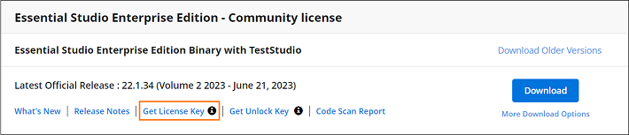

# Syncfusion Licensing Errors

Licensing error popup is displayed with various messages under different circumstances. Here are some ways to resolve different issues.

## Licensing errors

### License key not registered\Trial Expired

The following error message will be shown if a Syncfusion license key has not been registered in your application or if the trial key has expired after 30 days.

**Error message:**   This application was built using a trial version of Syncfusion Essential Studio. You should include the valid license key to remove the license validation message permanently.

**Solution:**

* If you use EJ2-Angular components through syncfusion installer, you can choose from the options listed below

1. If you **have a valid Syncfusion license**, you can **generate a license key for a specific version and product** from [this page](https://www.syncfusion.com/account/downloads).

   

2. If you **have a Syncfusion account and an active trial**, you can **generate the trial license key for a specific version and platform** from [this page](https://www.syncfusion.com/account/manage-trials/downloads).

3. If you **have a Syncfusion account but no active trials**, [purchase a license](https://www.syncfusion.com/sales/products) or [start your 30-day free trial](https://www.syncfusion.com/account/manage-trials/start-trials). Then you can generate the trial license key for **a specific version and platform** from [this page](https://www.syncfusion.com/account/downloads).

4. If you **do not already have a Syncfusion account**, you can create one [here](https://www.syncfusion.com/account/register) and [purchase a license](https://www.syncfusion.com/sales/products) or start your 30-day free trial. Then you can **generate the trial license key for a specific version and platform** from [this page](https://www.syncfusion.com/account/manage-trials/start-trials).

5. Also, you can generate the license key from claim license key page by clicking the **"Claim your FREE account"** click from the licensing warning message. Refer to this [help topic](https://ej2.syncfusion.com/angular/documentation/licensing/license-key-generation#Claim-License-Key) for more details.

* In your application, register the generated license key. Please refer to this [help topic](https://ej2.syncfusion.com/angular/documentation/licensing/license-key-registration/) for information on registering the license key.

### Invalid key

If the application is registered with an invalid key, another version of license key, or another platform's license key, the following error message will pop up when launching the application.

**Error Message:**   The included Syncfusion license key is invalid.

**Solution:**

* If you use EJ2-Angular components through syncfusion installer, you can choose from the options listed below

1. If you have a valid Syncfusion license, you can **generate a license key for a specific version and product** from [this page](https://www.syncfusion.com/account/downloads).

   

2. If you have a Syncfusion account and an active trial, you can **generate the trial license key for a specific version and product** from [this page](https://www.syncfusion.com/account/manage-trials/downloads).

3. If you **have a Syncfusion account but no active trials**, [purchase a license](https://www.syncfusion.com/sales/products) or [start your 30-day free trial](https://www.syncfusion.com/account/manage-trials/start-trials). Then you can **generate the trial license key for a specific version and product** from [this page](https://www.syncfusion.com/account/downloads).

4. If you **do not already have a Syncfusion account**, you can create one here and [purchase a license](https://www.syncfusion.com/sales/products) or [start your 30-day free trial](https://www.syncfusion.com/account/manage-trials/start-trials). Then you can **generate the trial license key for a specific version and product** from [this page](https://www.syncfusion.com/account/manage-trials/downloads).

5. Also, you can generate the license key from claim license key page by clicking the **"Claim your FREE account"** click from the licensing warning message. Refer to this [help topic](https://ej2.syncfusion.com/angular/documentation/licensing/license-key-generation#Claim-License-Key) for more details.

* In your application, register the generated license key. Please refer to this [help topic](https://ej2.syncfusion.com/angular/documentation/licensing/license-key-registration/) for information on registering the license key.

## Licensing errors from version 16.2.0* to 20.3.0*

### License key not registered

The following error message will be shown if a Syncfusion license key has not been registered in your application.

**Error message:**   This application was built using a trial version of Syncfusion Essential Studio. Please include a valid license to permanently remove this license validation message. You can also obtain a free 30 day evaluation license to temporarily remove this message during the evaluation period. Please refer to this [help topic](https://ej2.syncfusion.com/angular/documentation/licensing/licensing-errors#license-key-not-registered) for more information.

**Solution:**

* If you use EJ2-Angular components through syncfusion installer, you can choose from the options listed below

1. If you **have a valid Syncfusion license**, you can **generate a license key for a specific version and product** from [this page](https://www.syncfusion.com/account/downloads).

   

2. If you **have a Syncfusion account and an active trial**, you can **generate the trial license key for a specific version and platform** from [this page](https://www.syncfusion.com/account/manage-trials/downloads).

3. If you **have a Syncfusion account but no active trials**, [purchase a license](https://www.syncfusion.com/sales/products) or [start your 30-day free trial](https://www.syncfusion.com/account/manage-trials/start-trials). Then you can generate the trial license key for **a specific version and platform** from [this page](https://www.syncfusion.com/account/downloads).

4. If you **do not already have a Syncfusion account**, you can create one [here](https://www.syncfusion.com/account/register) and [purchase a license](https://www.syncfusion.com/sales/products) or start your 30-day free trial. Then you can **generate the trial license key for a specific version and platform** from [this page](https://www.syncfusion.com/account/manage-trials/start-trials).

* In your application, register the generated license key. Please refer to this [help topic](https://ej2.syncfusion.com/angular/documentation/licensing/license-key-registration/) for information on registering the license key.

### Invalid key

If the application is registered with an invalid key, another version of license key, or another platform’s license key, the following error message will pop up when launching the application.

**Error message:**   The included Syncfusion license is invalid. Please refer to this [help topic](https://ej2.syncfusion.com/angular/documentation/licensing/licensing-errors/#invalid-key) for more information.

**Solution:**

* If you use EJ2-Angular components through syncfusion installer, you can choose from the options listed below

1. If you have a valid Syncfusion license, you can **generate a license key for a specific version and product** from [this page](https://www.syncfusion.com/account/downloads).

   

2. If you have a Syncfusion account and an active trial, you can **generate the trial license key for a specific version and product** from [this page](https://www.syncfusion.com/account/manage-trials/downloads).

3. If you **have a Syncfusion account but no active trials**, [purchase a license](https://www.syncfusion.com/sales/products) or [start your 30-day free trial](https://www.syncfusion.com/account/manage-trials/start-trials). Then you can **generate the trial license key for a specific version and product** from [this page](https://www.syncfusion.com/account/downloads).

4. If you **do not already have a Syncfusion account**, you can create one here and [purchase a license](https://www.syncfusion.com/sales/products) or [start your 30-day free trial](https://www.syncfusion.com/account/manage-trials/start-trials). Then you can **generate the trial license key for a specific version and product** from [this page](https://www.syncfusion.com/account/manage-trials/downloads).

* In your application, register the generated license key. Please refer to this [help topic](https://ej2.syncfusion.com/angular/documentation/licensing/license-key-registration/) for information on registering the license key.

### Trial expired

The following error message will be shown if the trial key has expired after 30 days.

**Error message:**   Your Syncfusion trial license has expired. Please refer to this [help topic](https://ej2.syncfusion.com/angular/documentation/licensing/licensing-errors/#trial-expired) for more information.

**Solution:**   Purchase from [here](https://www.syncfusion.com/sales/products) to get a valid Syncfusion license.

### Platform Mismatch

If the application is registered with another platform’s license key, the following error message will pop up when launching the application.

**Error message:**   The included Syncfusion license is invalid (Platform mismatch). Please refer to this [help topic](https://ej2.syncfusion.com/angular/documentation/licensing/licensing-errors/#platform-mismatch) for more information.

**Solution:**

* License keys are version and product specific. So, if you use EJ2 Angular components through syncfusion installer, you can choose from the options listed below

1. If you have a valid Syncfusion license, you can **generate a license key for a specific version and product** from [this page](https://www.syncfusion.com/account/downloads).

   

2. If you have a Syncfusion account and an active trial, you can **generate the trial license key for a specific version and product** from [this page](https://www.syncfusion.com/account/manage-trials/downloads).

3. If you **have a Syncfusion account but no active trials**, [purchase a license](https://www.syncfusion.com/sales/products) or [start your 30-day free trial](https://www.syncfusion.com/account/manage-trials/start-trials). Then you can **generate the trial license key for a specific version and product** from [this page](https://www.syncfusion.com/account/downloads).

* In your application, register the generated license key. Please refer to this [help topic](https://ej2.syncfusion.com/angular/documentation/licensing/license-key-registration/) for information on registering the license key.

### Version Mismatch

If the application is registered with another version’s license key, the following error message will pop up when launching the application.

**Error message:**   The included Syncfusion license ({Registered Version}) is invalid for version {Required version}. Please refer to this [help topic](https://ej2.syncfusion.com/angular/documentation/licensing/licensing-errors/#version-mismatch) for more information.

**Solution:**

* License keys are version and product specific. So, if you use EJ2 Angular components through syncfusion installer, you can choose from the options listed below

1. If you have a valid Syncfusion license, you can **generate a license key for a specific version and product** from [this page](https://www.syncfusion.com/account/downloads).

   

2. If you have a Syncfusion account and an active trial, you can **generate the trial license key for a specific version and product** from [this page](https://www.syncfusion.com/account/manage-trials/downloads).

3. If you **have a Syncfusion account but no active trials**, [purchase a license](https://www.syncfusion.com/sales/products) or [start your 30-day free trial](https://www.syncfusion.com/account/manage-trials/start-trials). Then you can **generate the trial license key for a specific version and product** from [this page](https://www.syncfusion.com/account/downloads).

* In your application, register the generated license key. Please refer to this [help topic](https://ej2.syncfusion.com/angular/documentation/licensing/license-key-registration/) for information on registering the license key.

### Invalid license key structure using the npx command

If you are using `npx syncfusion-license activate` command with an invalid license key structure, the following console error message will appear.

**Error message:**   (Error) License key is not valid. Please refer to this [help topic](#invalid-license-key-structure-using-the-npx-command) for more information.

**Solution:**

* If you use EJ2-Angular components through syncfusion installer, you can choose from the options listed below

1. If you have a valid Syncfusion license, you can **generate a license key for a specific version and product** from [this page](https://www.syncfusion.com/account/downloads).

   

2. If you have a Syncfusion account and an active trial, you can **generate the trial license key for a specific version and product** from [this page](https://www.syncfusion.com/account/manage-trials/downloads).

3. If you **have a Syncfusion account but no active trials**, [purchase a license](https://www.syncfusion.com/sales/products) or [start your 30-day free trial](https://www.syncfusion.com/account/manage-trials/start-trials). Then you can **generate the trial license key for a specific version and product** from [this page](https://www.syncfusion.com/account/downloads).

4. If you **do not already have a Syncfusion account**, you can create one here and [purchase a license](https://www.syncfusion.com/sales/products) or [start your 30-day free trial](https://www.syncfusion.com/account/manage-trials/start-trials). Then you can **generate the trial license key for a specific version and product** from [this page](https://www.syncfusion.com/account/manage-trials/downloads).

* In your application, register the generated license key using the npx command. Please refer to this [help topic](https://ej2.syncfusion.com/angular/documentation/licensing/license-key-registration/#register-syncfusion-license-key-using-the-npx-command) for information on registering the license key.
