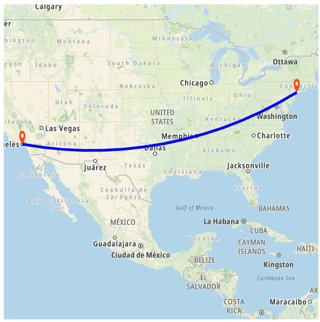

# Other maps in Angular Maps component

Apart from OpenStreetMap and Bing Maps, you can also render Maps from other online map service providers by specifying the URL provided by those providers in the [urlTemplate](https://ej2.syncfusion.com/angular/documentation/api/maps/layerSettingsModel/#urltemplate) property. The URL template concept has been implemented in such a way that any online map service providers using the following template can benefit from previewing their Map in the Syncfusion Angular Maps component.

<!-- markdownlint-disable MD034 -->

Sample Template: https://< domain_name >/maps/basic/{z}/{x}/{y}.png

* "${z}" - It represents zoom factor (level).
* "${x}" - It indicates tile image x-position (tileX).
* "${y}" - It indicates tile image y-position (tileY).

In this case, the key generated for those online map service providers can also be appended to the URL. This allows to create personalized Maps with your own content and imagery.

Following is an example of how to add a TomTom map. You can generate an API key by following the steps in this [link](https://developer.tomtom.com/map-display-api/documentation/product-information/introduction) and then adding the key to the URL.

```typescript

import { Component, OnInit } from '@angular/core';
import { Maps } from '@syncfusion/ej2-angular-maps';

@Component({
    selector: 'app-container',
    template:
    `<ejs-maps id='rn-container' style="display:block">
     <e-layers>
    <e-layer [urlTemplate]= 'urlTemplate'></e-layer>
    </e-layers>
    </ejs-maps>`
})
export class AppComponent implements OnInit {
    public urlTemplate: string;
    ngOnInit(): void {
           this.urlTemplate = "http://api.tomtom.com/map/1/tile/basic/main/level/tileX/tileY.png?key=subscription_key";
    }
}

```


## Enabling zooming and panning

Tile Maps layer can be zoomed and panned. Zooming helps to get a closer look at a particular area on a map for in-depth analysis. Panning helps to move a map around to focus the targeted area.

```typescript

import { Component, Inject, OnInit } from '@angular/core';
import { Maps, Zoom } from '@syncfusion/ej2-angular-maps';
Maps.Inject(Zoom);
@Component({
    selector: 'app-container',
    template:
    `<ejs-maps id='rn-container' style="display:block" [zoomSettings]='zoomSettings'>
     <e-layers>
    <e-layer [urlTemplate]='urlTemplate'></e-layer>
    </e-layers>
    </ejs-maps>`
})
export class AppComponent implements OnInit {
    public urlTemplate: string;
    public zoomSettings: object;
    ngOnInit(): void {
           this.urlTemplate = "http://api.tomtom.com/map/1/tile/basic/main/level/tileX/tileY.png?key=subscription_key";
           this.zoomSettings = {
              enable: true,
              toolbars: ["Zoom", "ZoomIn", "ZoomOut", "Pan", "Reset"]
           }
    }
}

```


## Adding markers and navigation line

Markers can be added to the layers of tile Maps by setting the corresponding location's coordinates of latitude and longitude using [markerSettings](https://ej2.syncfusion.com/angular/documentation/api/maps/layerSettingsModel/#markersettings) property. Navigation lines can be added on top of an tile Maps layer for highlighting a path among various places by setting the corresponding location's coordinates of latitude and longitude in the [navigationLineSettings](https://ej2.syncfusion.com/angular/documentation/api/maps/layerSettingsModel/#navigationlinesettings).

```typescript

import { Component, Inject, OnInit } from '@angular/core';
import { Maps, Zoom, Marker, NavigationLine } from '@syncfusion/ej2-angular-maps';
Maps.Inject(Zoom, Marker, NavigationLine);
@Component({
    selector: 'app-container',
    template:
    `<ejs-maps id='rn-container' style="display:block" [zoomSettings]='zoomSettings' [centerPosition]='centerPosition'>
     <e-layers>
    <e-layer [markerSettings]='markerSettings' [navigationLineSettings]='navigationLineSettings'></e-layer>
    </e-layers>
    </ejs-maps>`
})
export class AppComponent implements OnInit {
    public urlTemplate: string;
    public zoomSettings: object;
    public markerSettings: object;
    public navigationLineSettings: object;
    ngOnInit(): void {
            this.urlTemplate = "http://api.tomtom.com/map/1/tile/basic/main/level/tileX/tileY.png?key=subscription_key";
            this.zoomSettings = {
               zoomFactor: 4
            };
            this.centerPosition = {
               latitude: 29.394708,
                longitude: -94.954653
            };
            this.markerSettings = [{
                visible: true,
                height: 25,
                width: 15,
                dataSource: [
                    {
                        latitude: 34.060620,
                        longitude: -118.330491,
                        name: "California"
                    },
                    {
                        latitude: 40.724546,
                        longitude: -73.850344,
                        name: "New York"
                    }
                ]
            }];
            this.navigationLineSettings = [{
                visible: true,
                color: "blue",
                width: 5,
                angle: 0.1,
                latitude: [34.060620, 40.724546],
                longitude: [-118.330491,-73.850344]
            }];
    }
}

```



## Adding sublayer

Any GeoJSON shape can be rendered as a sublayer on top of the tile Maps layer for highlighting a particular continent or country in tile Maps by adding another layer and specifying the [type](https://ej2.syncfusion.com/angular/documentation/api/maps/layerSettingsModel/#type) property of Maps layer to **SubLayer**.

```typescript

import { Component, OnInit } from '@angular/core';
import { Maps } from '@syncfusion/ej2-angular-maps';
import { africa_continent } from 'africa-continent.ts';

@Component({
    selector: 'app-container',
    template:
    `<ejs-maps id='rn-container' style="display:block">
     <e-layers>
    <e-layer [urlTemplate] = "urlTemplate"></e-layer>
    <e-layer [type] = 'type' [shapeData]='shapeData' [shapeSettings]='shapeSettings'></e-layer>
    </e-layers>
    </ejs-maps>`
})
export class AppComponent implements OnInit {
    public urlTemplate: string;
    public type: string;
    public shapeData: object;
    public shapeSettings: object;
    ngOnInit(): void {
           this.urlTemplate = "http://api.tomtom.com/map/1/tile/basic/main/level/tileX/tileY.png?key=subscription_key";
           this.type = 'SubLayer';
           this.shapeData = africa_continent;
           this.shapeSettings = {
               fill: 'blue'
           };
    }
}

```


## Enabling legend

The legend can be added to the tile Maps by setting the [visible](https://ej2.syncfusion.com/angular/documentation/api/maps/legendSettingsModel/#visible) property of [legendSettings](https://ej2.syncfusion.com/angular/documentation/api/maps/legendSettingsModel) to **true**.

```typescript

import { Component, Inject, OnInit } from '@angular/core';
import { Maps } from '@syncfusion/ej2-angular-maps';
import { markerDataSource } from 'markerdata.ts';

@Component({
    selector: 'app-container',
    template:
    `<ejs-maps
      id="rn-container"
      style="display:block"
      [legendSettings]="legendSettings"
    >
      <e-layers>
        <e-layer [urlTemplate]= 'urlTemplate'
          [shapePropertyPath]="shapePropertyPath"
          [shapeDataPath]="shapeDataPath"
          [markerSettings]="markerSettings"
          [shapeSettings]="shapeSettings"
        ></e-layer>
      </e-layers>
    </ejs-maps>`
})
export class AppComponent implements OnInit {
  public shapeDataPath: string;
  public shapePropertyPath: string;
  public shapeSettings: object;
  public markerSettings: object;
  public legendSettings: object;
  public urlTemplate: string;
  ngOnInit(): void {
    this.urlTemplate = 'http://api.tomtom.com/map/1/tile/basic/main/level/tileX/tileY.png?key=subscription_key';
    this.shapeDataPath = 'name';
    this.shapePropertyPath = 'name';
    this.legendSettings = {
      visible: true,
      type: 'Markers',
      useMarkerShape: true,
      toggleLegendSettings: {
        enable: true,
        applyShapeSettings: false,
        border: {
          color: 'green',
          width: 2,
        },
      },
    };
    this.shapeSettings = {
      fill: '#E5E5E5',
    };
    this.markerSettings = [
      {
        dataSource: markerDataSource,
        colorValuePath: 'color',
        shapeValuePath: 'shape',
        legendText: 'country',
        visible: true,
      },
    ];
  }
}

```

