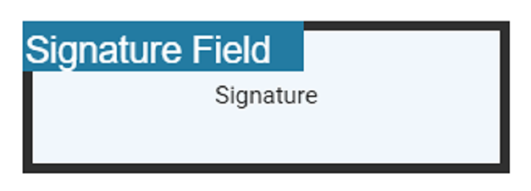
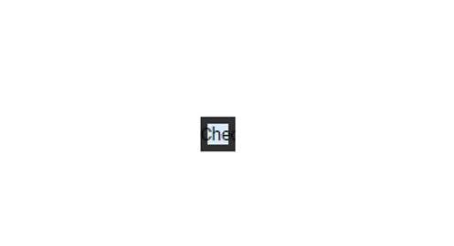
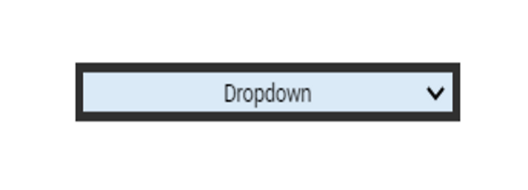

# Create form fields programmatically

The PDF Viewer control provides the option to add, edit and delete the Form Fields. The Form Fields type supported by the PDF Viewer Control are:

    * Textbox
    * Password
    * CheckBox
    * RadioButton
    * ListBox
    * DropDown
    * SignatureField
    * InitialField

## Add a form field to PDF document programmatically

Using addFormField method, the form fields can be added to the PDF document programmatically. We need to pass two parameters in this method. They are Form Field Type and Properties of Form Field Type. To add form field programmatically, Use the following code.












  


## Edit/Update form field programmatically

Using updateFormField method, Form Field can be updated programmatically. We should get the Form Field object/Id from FormFieldCollections property that you would like to edit and pass it as a parameter to updateFormField method. The second parameter should be the properties that you would like to update for Form Field programmatically. We have updated the value and background Color properties of Textbox Form Field.












  


## Delete form field programmatically

Using deleteFormField method, the form field can be deleted programmatically. We should retrieve the Form Field object/Id from FormFieldCollections property that you would like to delete and pass it as a parameter to deleteFormField method. To delete a Form Field programmatically, use the following code.












  


The following code illustrates how to delete a signature from the signature field using the `retrieveFormFields` and `clearFormFields` APIs.

```html
<!--Method to remove signature-->
<button (click)="removeSignature()">Remove Signature</button>
<!--Render PDF Viewer component-->
<ejs-pdfviewer id="pdfViewer"
               [serviceUrl]="service"
               [documentPath]="document"
               style="height:640px;display:block">
</ejs-pdfviewer>
```

```typescript
//Event triggers while clicking the Remove Signature button.
removeSignature() {
  var viewer = (<any>document.getElementById('pdfViewer')).ej2_instances[0];
  var forms = viewer.retrieveFormFields();
  //API to remove a signature from the signature field.
  viewer.clearFormFields(forms[8]);
}

```

[View sample in GitHub](https://github.com/SyncfusionExamples/angular-pdf-viewer-examples/tree/master/Form%20fields/Delete%20signature%20programmatically%20from%20signature%20field)

## Saving the form fields

When the download icon is selected on the toolbar, the Form Fields will be saved in the PDF document and this action will not affect the original document. Refer the below GIF for further reference.


You can invoke download action using following code snippet.

```html
<script>
    window.onload = function () {
        var pdfViewer = document.getElementById('pdfviewer').ej2_instances[0];
        pdfViewer.download();
    }
</script>

```

## Printing the form fields

When the print icon is selected on the toolbar, the PDF document will be printed along with the Form Fields added to the pages and this action will not affect the original document. Refer the below GIF for further reference.


You can invoke print action using the following code snippet.,

```html
<script>
    window.onload = function () {
        var pdfViewer = document.getElementById('pdfviewer').ej2_instances[0];
        pdfViewer.print.print();
    }
</script>

```

## Open the existing PDF document

We can open the already saved PDF document contains Form Fields in it by clicking the open icon in the toolbar. Refer the below GIF for further reference.


## Validate form fields

The form fields in the PDF Document will be validated when the `enableFormFieldsValidation` is set to true and hook the validateFormFields. The validateFormFields will be triggered when the PDF document is downloaded or printed with the non-filled form fields. The non-filled fields will be obtained in the `nonFillableFields` property of the event arguments of validateFormFields.

Add the following code snippet to validate the form fields,

```typescript

import { ViewChild } from '@angular/core';
import { Component, OnInit } from '@angular/core';
import { PdfViewerComponent, LinkAnnotationService, BookmarkViewService,
         MagnificationService, ThumbnailViewService, ToolbarService,
         NavigationService, TextSearchService, TextSelectionService,
         PrintService, AnnotationService, FormDesignerService,
         FormFieldsService, LoadEventArgs, TextFieldSettings
       } from '@syncfusion/ej2-angular-pdfviewer';

@Component({
  selector: 'app-root',
  // Specifies the template string for the PDF Viewer component.
  template: `<div class="content-wrapper">
               <ejs-pdfviewer id="pdfViewer"
                     #pdfviewer [serviceUrl]='service'
                     [documentPath]='document'
                     [enableFormFieldsValidation]=true
                     (validateFormFields)='validateFormFields($event)'
                     style="height:640px;display:block">
               </ejs-pdfviewer>
             </div>`,
  providers: [ LinkAnnotationService, BookmarkViewService, MagnificationService,
               ThumbnailViewService, ToolbarService, NavigationService,
               TextSearchService, TextSelectionService, PrintService,
               AnnotationService, FormDesignerService, FormFieldsService]
})
export class AppComponent implements OnInit {
  @ViewChild('pdfviewer')
  public pdfviewerControl: PdfViewerComponent;
  public service: string = 'https://ej2services.syncfusion.com/production/web-services/api/pdfviewer';
  public document: string = 'FormDesigner.pdf';

  public validateFormFields(e: ValidateFormFieldsArgs): void {
    this.e.nonFillableFields;
  }
}

```

## Export and import form fields

The PDF Viewer control provides the support to export and import the form field data in the following formats using the methods `importFormFields`, `exportFormFields`, `exportFormFieldsAsObject`.

* FDF
* XFDF
* JSON

### Export and import as FDF

Using the `exportFormFields` method, the form field data can be exported in the specified data format. This method accepts two parameters:

* The first one must be the destination path for the exported data. If path is not specified, it will ask for the location while exporting.
* The second parameter should be the format type of the form data.

The following code explains how to export and import the form field data as FDF.

```html

<button (click)="OnExportFdf()">Export FDF</button>
<button (click)="OnImportFdf()">Import FDF</button>

```

```typescript
// Event triggers on the Export FDF button click.
OnExportFdf() {
  var viewer = (<any>document.getElementById('pdfViewer')).ej2_instances[0];
  // Data must be the desired path for the exported document.
  viewer.exportFormFields('Data', FormFieldDataFormat.Fdf);
}

// Event triggers on the Import FDF button click.
OnImportFdf() {
  var viewer = (<any>document.getElementById('pdfViewer')).ej2_instances[0];
  // The file for importing the form fields should be placed in the desired location and the path should be provided correctly
  viewer.importFormFields('File', FormFieldDataFormat.Fdf);
}
```

### Export and import as XFDF

The following code explains how to export and import the form field data as XFDF.

```html

<button (click)="OnExportXfdf()">Export XFDF</button>
<button (click)="OnImportXfdf()">Import XFDF</button>

```

```typescript
// Event triggers on the Export XFDF button click.
OnExportXfdf() {
  var viewer = (<any>document.getElementById('pdfViewer')).ej2_instances[0];
  // Data must be the desired path for the exported document.
  viewer.exportFormFields('Data', FormFieldDataFormat.Xfdf);
}

// Event triggers on the Import XFDF button click.
OnImportXfdf() {
  var viewer = (<any>document.getElementById('pdfViewer')).ej2_instances[0];
  // The file for importing the form fields should be placed in the desired location and the path should be provided correctly
  viewer.importFormFields('File', FormFieldDataFormat.Xfdf);
}
```

### Export and import as JSON

The following code explains how to export and import the form field data as JSON.

```html

<button (click)="OnExportJson()">Export JSON</button>
<button (click)="OnImportJson()">Import JSON</button>

```

```typescript
// Event triggers on the Export JSON button click.
OnExportJson() {
  var viewer = (<any>document.getElementById('pdfViewer')).ej2_instances[0];
  // Data must be the desired path for the exported document.
  viewer.exportFormFields('Data', FormFieldDataFormat.Json);
}

// Event triggers on the Import JSON button click.
OnImportJson() {
  var viewer = (<any>document.getElementById('pdfViewer')).ej2_instances[0];
  // The file for importing the form fields should be placed in the desired location and the path should be provided correctly
  viewer.importFormFields('File', FormFieldDataFormat.Json);
}
```

### Export and import as Object

The PDF Viewer control supports exporting the form field data as an object, and the exported data will be imported into the current PDF document from the object.

The following code shows how to export the form field data as an object and import the form field data from that object into the current PDF document via a button click.

```html

<button (click)="exportDataAsObject()">Export Object</button>
<button (click)="importData()">Import Data</button>

```

```typescript
var exportedData;

// Event triggers on the Export Object button click.
exportDataAsObject() {
  var viewer = (<any>document.getElementById('pdfViewer')).ej2_instances[0];
  // Export the form fields data to an FDF object.
  exportedData = viewer.exportFormFieldsAsObject(FormFieldDataFormat.Fdf);
  //// Export the form fields data to an XFDF object.
  //exportedData = viewer.exportFormFieldsAsObject(FormFieldDataFormat.Xfdf);
  //// Export the form fields data to an JSON object.
  //exportedData = viewer.exportFormFieldsAsObject(FormFieldDataFormat.Json);
}

// Event triggers on Import Data button click.
importData() {
  var viewer = (<any>document.getElementById('pdfViewer')).ej2_instances[0];
  // Import the form fields data from the FDF object into the current PDF document.
  viewer.importFormFields(exportedData, FormFieldDataFormat.Fdf);
  //// Import the form fields data from the XFDF object into the current PDF document.
  //viewer.importFormFields(exportedData, FormFieldDataFormat.Xfdf);
  //// Import the form fields data from the JSON object into the current PDF document.
  //viewer.importFormFields(exportedData, FormFieldDataFormat.Json);
}
```

## Signature and initial fields settings

Using the `updateFormField` method, the form fields can be updated programmatically.

The following code example explains how to update the signature field properties on a button click.

```html

<button (click)="updateProperties()">Update Properties</button>

```

```typescript
    // Event triggers on the Update Properties button click.
    updateProperties() {
        var formField = viewer.retrieveFormFields();
        viewer.formDesignerModule.updateFormField(formField[0], {
            name: 'Initial',
            isReadOnly: true,
            visibility: 'visible',
            isRequired: false,
            isPrint: true,
            tooltip: 'Initial',
            thickness: 4
        });
}

```

The following code example explains how to update the properties of the signature field added to the document from the form designer toolbar.

```html
    <ejs-pdfviewer
      id="pdfViewer"
      [serviceUrl]="service"
      [documentPath]="document"
      [initialFieldSettings] = "initialFieldSettings"
      [signatureFieldSettings] = "signatureFieldSettings"
      style="height:640px;display:block"
    > </ejs-pdfviewer>
```

```typescript
      // Properties to customize the signature field settings
      public signatureFieldSettings = {
        // Set the name of the form field element.
        name: 'Signature',
        // Specify whether the signature field is in read-only or read-write mode.
        isReadOnly: false,
        // Set the visibility of the form field.
        visibility: 'visible',
        // Specify whether the field is mandatory or not.
        isRequired: false,
        // Specify whether to print the signature field.
        isPrint: true,
        // Set the text to be displayed as a tooltip.
        tooltip: 'Signature',
        // Set the thickness of the signature field. To hide the borders, set the value to 0 (zero).
        thickness: 4,
        // Specify the properties of the signature Dialog Settings in the signature field.
        signatureDialogSettings: {
            displayMode: DisplayMode.Draw | DisplayMode.Upload | DisplayMode.Text,
            hideSaveSignature: false,
        },
        // Specify the properties of the signature indicator in the signature field.
        signatureIndicatorSettings: {
            opacity: 1,
            backgroundColor: '#237ba2',
            height: 50,
            fontSize: 15,
            text: 'Signature Field',
            color: 'white'
        }
  };

```



The following code example explains how to update the properties of the initial field added to the document from the form designer toolbar.

```typescript
     // Properties to customize the initial field settings
     public initialFieldSettings = {
        // Set the name of the form field element.
        name: 'Initial',
        // Specify whether the initial field is in read-only or read-write mode.
        isReadOnly: false,
        // Set the visibility of the form field.
        visibility: 'visible',
        // Specify whether the field is mandatory or not.
        isRequired: false,
        // Specify whether to print the initial field.
        isPrint: true,
        // Set the text to be displayed as tooltip.
        tooltip: 'Initial',
        // Set the thickness of the initial field. To hide the borders, set the value to 0 (zero).
        thickness: 4,
        // Specify the properties of the initial indicator in the initial field.
        initialIndicatorSettings: {
          opacity: 1,
          backgroundColor: '#237ba2',
          height: 50,
          fontSize: 15,
          text: 'Initial Field',
          color: 'white',
        },
        // Specify the properties of the initial Dialog Settings in the intial field.
        initialDialogSettings: {
          displayMode: DisplayMode.Draw | DisplayMode.Upload | DisplayMode.Text,
          hideSaveSignature: false,
        },
    };

```


## Textbox field settings

Using the `updateFormField` method, the form fields can be updated programmatically.

The following code example explains how to update the Textbox field properties on a button click.

```html

<button (click)="updateProperties()">Update Properties</button>

```

```typescript
  // Event triggers on the Update Properties button click.
  updateProperties() {
    var viewer = (<any>document.getElementById('pdfViewer')).ej2_instances[0];
    var formField = viewer.retrieveFormFields();
    viewer.formDesignerModule.updateFormField(formField[0], {
      name: 'Textbox',
      isReadOnly: true,
      visibility: 'visible',
      isRequired: false,
      isPrint: true,
      tooltip: 'Textbox',
      thickness: 4,
      value:'Textbox',
      fontFamily: 'Courier',
      fontSize: 10,
      fontStyle: 'None',
      color: 'black',
      borderColor: 'black',
      backgroundColor: 'white',
      alignment: 'Left',
      maxLength: 0,
      isMultiline: false,
      bounds: { X: 146, Y: 229, Width: 150, Height: 24 }
    });
  }

```

The following code example explains how to update the properties of the Textbox field added to the document from the form designer toolbar.

```html
  <ejs-pdfviewer
    id="pdfViewer"
    [serviceUrl]="service"
    [documentPath]="document"
    [textFieldSettings] = "textFieldSettings"
    style="height:640px;display:block"> 
  </ejs-pdfviewer>
```

```typescript
  // Properties to customize the Textbox field settings
  public textFieldSettings = {
    // Set the name of the form field element.
    name: 'Textbox',
    // Specify whether the Textbox field is in read-only or read-write mode.
    isReadOnly: false,
    // Set the visibility of the form field.
    visibility: 'visible',
    // Specify whether the field is mandatory or not.
    isRequired: false,
    // Specify whether to print the Textbox field.
    isPrint: true,
    // Set the text to be displayed as a tooltip.
    tooltip: 'Textbox',
    // Set the thickness of the Textbox field. To hide the borders, set the value to 0 (zero).
    thickness: 4,
    // Set the value of the form field element.
    value:'Textbox',
    // Set the font family of the textbox field.
    fontFamily: 'Courier',
    // Set the font size of the textbox field.
    fontSize: 10,
    // Specify the font style
    fontStyle: 'None',
    // Set the font color of the textbox field.
    color: 'black',
    // Set the border color of the textbox field.
    borderColor: 'black',
    // Set the background color of the textbox field.
    backgroundColor: 'White',
    // Set the alignment of the text.
    alignment: 'Left',
    // Set the maximum character length.
    maxLength: 0,
    // Allows multiline input in the text field. FALSE, by default.
    isMultiline: false
  };

```


## Password field settings

Using the `updateFormField` method, the form fields can be updated programmatically.

The following code example explains how to update the Password field properties on a button click.

```html

<button (click)="updateProperties()">Update Properties</button>

```

```typescript

  // Event triggers on the Update Properties button click.
  updateProperties() {
    var viewer = (<any>document.getElementById('pdfViewer')).ej2_instances[0];
    var formField = viewer.retrieveFormFields();
    viewer.formDesignerModule.updateFormField(formField[0], {
      name: 'Password',
      isReadOnly: true,
      visibility: 'visible',
      isRequired: false,
      isPrint: true,
      tooltip: 'Password',
      thickness: 4,
      value:'Password',
      fontFamily: 'Courier',
      fontSize: 10,
      fontStyle: 'None',
      color: 'black',
      borderColor: 'black',
      backgroundColor: 'white',
      alignment: 'Left',
      maxLength: 0,
      bounds: { X: 148, Y: 229, Width: 150, Height: 24 }
    });
  }

```

The following code example explains how to update the properties of the Password field added to the document from the form designer toolbar.

```html
  <ejs-pdfviewer
    id="pdfViewer"
    [serviceUrl]="service"
    [documentPath]="document"
    [passwordFieldSettings] = "passwordFieldSettings"
    style="height:640px;display:block"> 
  </ejs-pdfviewer>
```

```typescript
  // Properties to customize the Password field settings
  public passwordFieldSettings = {
    // Set the name of the form field element.
    name: 'Password',
    // Specify whether the Password field is in read-only or read-write mode.
    isReadOnly: false,
    // Set the visibility of the form field.
    visibility: 'visible',
    // Specify whether the field is mandatory or not.
    isRequired: false,
    // Specify whether to print the Password field.
    isPrint: true,
    // Set the text to be displayed as a tooltip.
    tooltip: 'Password',
    // Set the thickness of the Password field. To hide the borders, set the value to 0 (zero).
    thickness: 4,
    // Set the value of the form field element.
    value:'Password',
    // Set the font family of the Password field.
    fontFamily: 'Courier',
    // Set the font size of the Password field.
    fontSize: 10,
    // Specify the font style
    fontStyle: 'None',
    // Set the font color of the Password field.
    color: 'black',
    // Set the border color of the Password field.
    borderColor: 'black',
    // Set the background color of the Password field.
    backgroundColor: 'white',
    // Set the alignment of the text.
    alignment: 'Left',
    // Set the maximum character length.
    maxLength: 0,
  };

```


## CheckBox field settings

Using the `updateFormField` method, the form fields can be updated programmatically.

The following code example explains how to update the CheckBox field properties on a button click.

```html

<button (click)="updateProperties()">Update Properties</button>

```

```typescript

  // Event triggers on the Update Properties button click.
  updateProperties() {
    var viewer = (<any>document.getElementById('pdfViewer')).ej2_instances[0];
    var formField = viewer.retrieveFormFields();
    viewer.formDesignerModule.updateFormField(formField[0], {
      name: 'CheckBox',
      isReadOnly: true,
      visibility: 'visible',
      isRequired: false,
      isPrint: true,
      tooltip: 'CheckBox',
      thickness: 4,
      isChecked: true,
      backgroundColor: 'white',
      borderColor: 'black',
    });
  }

```

The following code example explains how to update the properties of the CheckBox field added to the document from the form designer toolbar.

```html
  <ejs-pdfviewer
    id="pdfViewer"
    [serviceUrl]="service"
    [documentPath]="document"
    [checkBoxFieldSettings] = "checkBoxFieldSettings"
    style="height:640px;display:block"> 
  </ejs-pdfviewer>
```

```typescript
  // Properties to customize the CheckBox field settings
  public checkBoxFieldSettings = {
    // Set the name of the form field element.
    name: 'CheckBox',
    // Specify whether the CheckBox field is in read-only or read-write mode.
    isReadOnly: false,
    // Set the visibility of the form field.
    visibility: 'visible',
    // Specify whether the field is mandatory or not.
    isRequired: false,
    // Specify whether to print the CheckBox field.
    isPrint: true,
    // Set the text to be displayed as a tooltip.
    tooltip: 'CheckBox',
    // Set the thickness of the CheckBox field. To hide the borders, set the value to 0 (zero).
    thickness: 4,
    // Specifies whether the check box is in checked state or not.
    isChecked: true,
    // Set the background color of the check box in hexadecimal string format.
    backgroundColor: 'white',
    // Set the border color of the check box field.
    borderColor: 'black'
  };

```



## RadioButton field settings

Using the `updateFormField` method, the form fields can be updated programmatically.

The following code example explains how to update the RadioButton field properties on a button click.

```html

<button (click)="updateProperties()">Update Properties</button>

```

```typescript

  // Event triggers on the Update Properties button click.
  updateProperties() {
    var viewer = (<any>document.getElementById('pdfViewer')).ej2_instances[0];
    var formField = viewer.retrieveFormFields();
    viewer.formDesignerModule.updateFormField(formField[0], {
        name: 'RadioButton',
        isReadOnly: true,
        visibility: 'visible',
        isRequired: false,
        isPrint: true,
        tooltip: 'RadioButton',
        thickness: 4,
        isSelected: true,
        backgroundColor: 'white',
        borderColor: 'black',
    });
  }

```

The following code example explains how to update the properties of the RadioButton field added to the document from the form designer toolbar.

```html
  <ejs-pdfviewer
    id="pdfViewer"
    [serviceUrl]="service"
    [documentPath]="document"
    [radioButtonFieldSettings] = "radioButtonFieldSettings"
    style="height:640px;display:block"> 
  </ejs-pdfviewer>
```

```typescript
  // Properties to customize the RadioButton field settings
  public radioButtonFieldSettings = {
    // Set the name of the form field element.
    name: 'RadioButton',
    // Specify whether the RadioButton field is in read-only or read-write mode.
    isReadOnly: false,
    // Set the visibility of the form field.
    visibility: 'visible',
    // Specify whether the field is mandatory or not.
    isRequired: false,
    // Specify whether to print the RadioButton field.
    isPrint: true,
    // Set the text to be displayed as a tooltip.
    tooltip: 'RadioButton',
    // Set the thickness of the RadioButton field. To hide the borders, set the value to 0 (zero).
    thickness: 4,
    // Specifies whether the radio button is in checked state or not.
    isSelected: true,
    // Set the background color of the radio button in hexadecimal string format.
    backgroundColor: 'white',
    // Set the border color of the radio button field.
    borderColor: 'black'
  };

```


## ListBox field settings

Using the `updateFormField` method, the form fields can be updated programmatically.

The following code example explains how to update the ListBox field properties on a button click.

```html

<button (click)="updateProperties()">Update Properties</button>

```

```typescript

  // Event triggers on the Update Properties button click.
  updateProperties() {
    var viewer = (<any>document.getElementById('pdfViewer')).ej2_instances[0];
    var formField = viewer.retrieveFormFields();
    var customOptions  = [{itemName:'item1',itemValue:'item1'}, {itemName:'item2',itemValue:'item2'}, {itemName:'item3',itemValue:'item3'}]
    viewer.formDesignerModule.updateFormField(formField[0], {
      name: 'ListBox',
      isReadOnly: true,
      visibility: 'visible',
      isRequired: false,
      isPrint: true,
      tooltip: 'ListBox',
      thickness: 4,
      fontFamily: 'Courier',
      fontSize: 10,
      fontStyle: 'None',
      color: 'black',
      borderColor: 'black',
      backgroundColor: 'white',
      alignment: 'Left',
      options: customOptions,
    });
  }

```

The following code example explains how to update the properties of the ListBox field added to the document from the form designer toolbar.

```html
  <ejs-pdfviewer
    id="pdfViewer"
    [serviceUrl]="service"
    [documentPath]="document"
    [listBoxFieldSettings] = "listBoxFieldSettings"
    style="height:640px;display:block"> 
  </ejs-pdfviewer>
```

```typescript
  // Properties to customize the ListBox field settings
  public listBoxFieldSettings = {
     var customOptions  = [{itemName:'item1',itemValue:'item1'}, {itemName:'item2',itemValue:'item2'}, {itemName:'item3',itemValue:'item3'}]
    // Set the name of the form field element.
    name: 'ListBox',
    // Specify whether the ListBox field is in read-only or read-write mode.
    isReadOnly: false,
    // Set the visibility of the form field.
    visibility: 'visible',
    // Specify whether the field is mandatory or not.
    isRequired: false,
    // Specify whether to print the ListBox field.
    isPrint: true,
    // Set the text to be displayed as a tooltip.
    tooltip: 'ListBox',
    // Set the thickness of the ListBox field. To hide the borders, set the value to 0 (zero).
    thickness: 4,
    // Set the value of the form field element.
    value:'ListBox',
    // Set the font family of the ListBox field.
    fontFamily: 'Courier',
    // Set the font size of the ListBox field.
    fontSize: 10,
    // Specify the font style
    fontStyle: 'None',
    // Set the  font color of the ListBox field.
    color: 'black',
    // Set the border color of the ListBox field.
    borderColor: 'black',
    // Set the background color of the ListBox field.
    backgroundColor: 'White',
    // Set the alignment of the text.
    alignment: 'Left',
    // Set the listbox items.
    options: customOptions
  };

```


## DropDown field settings

Using the `updateFormField` method, the form fields can be updated programmatically.

The following code example explains how to update the DropDown field properties on a button click.

```html

<button (click)="updateProperties()">Update Properties</button>

```

```typescript

  // Event triggers on the Update Properties button click.
  updateProperties() {
    var viewer = (<any>document.getElementById('pdfViewer')).ej2_instances[0];
    var formField = viewer.retrieveFormFields();
    var customOptions  = [{itemName:'item1',itemValue:'item1'}, {itemName:'item2',itemValue:'item2'}, {itemName:'item3',itemValue:'item3'}]
    viewer.formDesignerModule.updateFormField(formField[0], { 
        name: 'DropDown',
        isReadOnly: true,
        visibility: 'visible',
        isRequired: false,
        isPrint: true,
        tooltip: 'DropDown',
        thickness: 4,
        fontFamily: 'Courier',
        fontSize: 10,
        fontStyle: 'None',
        color: 'black',
        borderColor: 'black',
        backgroundColor: 'white',
        alignment: 'Left',
        options: customOptions,
    });
  }

```

The following code example explains how to update the properties of the DropDown field added to the document from the form designer toolbar.

```html
  <ejs-pdfviewer
    id="pdfViewer"
    [serviceUrl]="service"
    [documentPath]="document"
    [DropdownFieldSettings] = "DropdownFieldSettings"
    style="height:640px;display:block"> 
  </ejs-pdfviewer>
```

```typescript

  // Properties to customize the DropDown field settings
  public DropdownFieldSettings = {
    var customOptions = [{itemName:'item1',itemValue:'item1'}, {itemName:'item2',itemValue:'item2'}, {itemName:'item3',itemValue:'item3'}]
    // Set the name of the form field element.
    name: 'DropDown',
    // Specify whether the DropDown field is in read-only or read-write mode.
    isReadOnly: false,
    // Set the visibility of the form field.
    visibility: 'visible',
    // Specify whether the field is mandatory or not.
    isRequired: false,
    // Specify whether to print the DropDown field.
    isPrint: true,
    // Set the text to be displayed as a tooltip.
    tooltip: 'DropDown',
    // Set the thickness of the DropDown field. To hide the borders, set the value to 0 (zero).
    thickness: 4,
    // Set the value of the form field element.
    value:'DropDown',
    // Set the font family of the DropDown field.
    fontFamily: 'Courier',
    // Set the font size of the DropDown field.
    fontSize: 10,
    // Specify the font style
    fontStyle: 'None',
    // Set the  font color of the DropDown field.
    color: 'black',
    // Set the border color of the DropDown field.
    borderColor: 'black',
    // Set the background color of the DropDown field.
    backgroundColor: 'White',
    // Set the alignment of the text.
    alignment: 'Left',
    // Set the DropDown items.
    options: customOptions
  };

```

