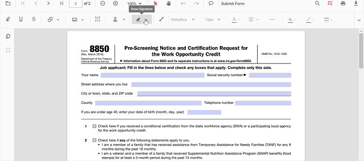
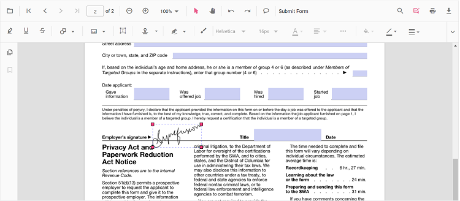

# Handwritten Signature

The PDF Viewer control supports adding the handwritten signatures to a PDF document. The handwritten signature reduces the paperwork of reviewing the content and verifies it digitally.

## Adding a handwritten signature to the PDF document

The handwritten signature can be added to the PDF document using the annotation toolbar.

* Click the **Edit Annotation** button in the PDF Viewer toolbar. A toolbar appears below it.
* Select the **Handwritten Signature** button in the annotation toolbar. The signature panel will appear.

* Draw the signature in the signature panel.

* Then, click the **Create** button and move the signature using the mouse and place them in the desired location.

## Editing the properties of handwritten signature

The stroke color, border thickness, and opacity of the handwritten signature can be edited using the edit stroke color tool, edit thickness tool, and edit opacity tool in the annotation toolbar.

