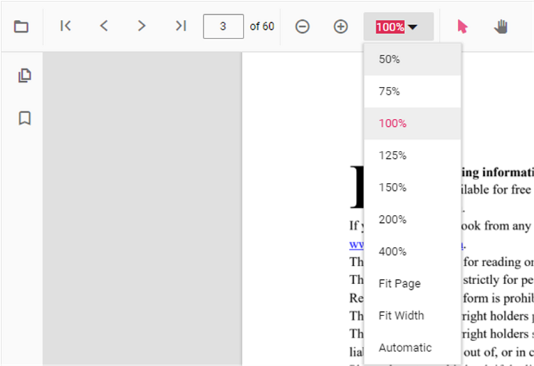

# Magnification

The magnification tools of the PDF Viewer contains ZoomIn, ZoomOut, Zoom, FitPage, and FitWidth tools in the
default toolbar. The PDF Viewer also has an option to show or hide the magnification tools in the
default toolbar.

The following code snippet describes how to enable the magnification in PDF Viewer.

```typescript
import { Component, OnInit } from '@angular/core';
import { LinkAnnotationService, BookmarkViewService, MagnificationService,
         ThumbnailViewService, ToolbarService, NavigationService,
         TextSearchService, AnnotationService, TextSelectionService,
         PrintService
       } from '@syncfusion/ej2-angular-pdfviewer';

@Component({
  selector: 'app-container',
  // specifies the template string for the PDF Viewer component
  template: `<div class="content-wrapper">
                  <ejs-pdfviewer id="pdfViewer"
                                [serviceUrl]='service'
                                [documentPath]='document'
                                enableMagnification="true"
                                style="height:640px;display:block">
                  </ejs-pdfviewer>
            </div>`,
  providers: [ LinkAnnotationService, BookmarkViewService, MagnificationService,
               ThumbnailViewService, ToolbarService, NavigationService,
               AnnotationService, TextSearchService, TextSelectionService,
               PrintService]
  })
  export class AppComponent implements OnInit {
    public service = 'https://ej2services.syncfusion.com/production/web-services/api/pdfviewer';
    public document = 'PDF_Succinctly.pdf';
  }
```

The following magnification options are available in the default toolbar of PDF Viewer,

* **ZoomIn**:- Zoom in from the current zoom value of PDF pages.
* **ZoomOut**:- Zoom out from the current zoom value of PDF pages.
* **Zoom**:- Zoom to specific zoom value of PDF pages.
* **FitPage**:- Fits the page width with in the available view port size.
* **FitWidth**:- Fits the view port width based on the page content size.
* **Auto**:- Fits the page content with-in the viewport on resizing action.



>PDF Viewer can support the zoom value ranges from 50 to 400.

## See also

* [Toolbar items](./toolbar)
* [Feature Modules](./feature-module)