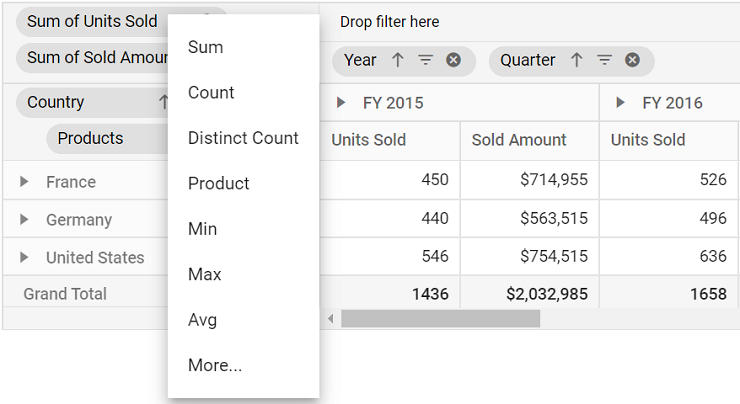

# Aggregation in Angular Pivotview component

> This feature is applicable only for the relational data source.

End user can perform calculations over a group of values (exclusively for value fields bound in value axis) using the aggregation option. By default, values are added (summed) together. The other aggregation types are explained below.

> The fields with data type such as number support all aggregation types mentioned below except for **"CalculatedField"**. The fields with data type such as string, date, datetime, boolean, etc., support **"Count"** and **"DistinctCount"** aggregation types alone.

| Operator | Description |
|------|-------------|
| Sum| Displays the pivot table values with sum.|
| Product| Displays the pivot table values with product.|
| Count| Displays the pivot table values with count.|
| DistinctCount| Displays the pivot table values with distinct count.|
| Min| Displays the pivot table with minimum value.|
| Max| Displays the pivot table with maximum value.|
| Avg| Displays the pivot table values with average.|
| Median| Displays the pivot table values with median.|
| Index| Displays the pivot table values with index.|
| PopulationStDev| Displays the pivot table values with standard deviation of population.|
| SampleStDev| Displays the pivot table values with sample standard deviation.|
| PopulationVar| Displays the pivot table values with variance of population.|
| SampleVar| Displays the pivot table values with sample variance.|
| RunningTotals| Displays the pivot table values with running totals.|
| DifferenceFrom| Displays the pivot table values with difference from the value of the base item in the base field.|
| PercentageOfDifferenceFrom| Displays the pivot table values with percentage difference from the value of the base item in the base field.|
| PercentageOfGrandTotal| Displays the pivot table values with percentage of grand total of all values.|
| PercentageOfColumnTotal| Displays the pivot table values in each column with percentage of total values for the column.|
| PercentageOfRowTotal| Displays the pivot table values in each row with percentage of total values for the row.|
| PercentageOfParentTotal| Displays the pivot table values with percentage of total of all values based on selected field.|
| PercentageOfParentColumnTotal| Displays the pivot table values with percentage of its parent total in each column.|
| PercentageOfParentRowTotal| Displays the pivot table values with percentage of its parent total in each row.|
| CalculatedField| Displays the pivot table with calculated field values. It allows user to create a new calculated field alone.|

## Assigning aggregation type for value fields through API

For each value field, the aggregation type can be set using the property [`type`](https://ej2.syncfusion.com/angular/documentation/api/pivotview/fieldOptionsModel/#type) in [`values`](https://ej2.syncfusion.com/angular/documentation/api/pivotview/dataSourceSettings/#values). Meanwhile, aggregation types like **DifferenceFrom** and **PercentageOfDifferenceFrom** can check for specific field of specific item using [`baseField`](https://ej2.syncfusion.com/angular/documentation/api/pivotview/fieldOptionsModel/#basefield) and [`baseItem`](https://ej2.syncfusion.com/angular/documentation/api/pivotview/fieldOptionsModel/#baseitem) properties. Likewise, **PercentageOfParentTotal** type can for specific field using [`baseField`](https://ej2.syncfusion.com/angular/documentation/api/pivotview/fieldOptionsModel/#basefield) property. For instance, the aggregation type **DifferenceFrom** would intake the specified field and its corresponding member as input and its value is compared across other members in the same field and also across different fields to formulate an appropriate output value.  

* [`type`](https://ej2.syncfusion.com/angular/documentation/api/pivotview/fieldOptionsModel/#type): It allows to set the aggregate type of the field.
* [`baseField`](https://ej2.syncfusion.com/angular/documentation/api/pivotview/fieldOptionsModel/#basefield): It allows to set the specific field to aggregate the values.
* [`baseItem`](https://ej2.syncfusion.com/angular/documentation/api/pivotview/fieldOptionsModel/#baseitem): It allows to set the specific member to aggregate the values.












  


> By default, the aggregation will be considered as **Sum** to the value fields which had number type and for the value fields which had non-number type values such as string, date, datetime, boolean, etc., the aggregation type will be considered as **Count**.

## Modifying aggregation type for value fields at runtime

Aggregation types can be changed easily through UI at runtime. The value fields bound to grouping bar and field list appears with a dropdown icon which helps to select an appropriate aggregation type for the respective value field. On selection, the values in the pivot table will be changed dynamically.

<!-- markdownlint-disable MD012 -->

 
 

## Show desired aggregation types in its dropdown menu

By default, all the aggregation types are displayed in the dropdown menu available in buttons. However, based on the request for an application, we may need to show selective aggregation types on our own. This can be achieved using the [`aggregateTypes`](https://ej2.syncfusion.com/angular/documentation/api/pivotview/#aggregatetypes) property.












  


## Hiding aggregation type from button text

By default, in value axis each field would be displayed by its name and aggregation type together. To hide aggregation type and display field name alone, set the property [`showAggregationOnValueField`](https://ej2.syncfusion.com/angular/documentation/api/pivotview/dataSourceSettings/#showaggregationonvaluefield)  in [`dataSourceSettings`](https://ej2.syncfusion.com/angular/documentation/api/pivotview/dataSourceSettings/) to **false**.












  


## Hiding aggregation type icon from UI

By default, the icon to set aggregation type is enabled in the grouping bar. To disable this icon, set the property [`showValueTypeIcon`](https://ej2.syncfusion.com/angular/documentation/api/pivotview/groupingBarSettings/#showvaluetypeicon) in [`groupingBarSettings`](https://ej2.syncfusion.com/angular/documentation/api/pivotview/groupingBarSettings/) to **false**.

> Icon to change the aggregation type can be hidden only in Grouping Bar but not in Field List at the moment.












  


## Event

### AggregateCellInfo

The event [`aggregateCellInfo`](https://ej2.syncfusion.com/angular/documentation/api/pivotview/#aggregatecellinfo) triggers every time while rendering value cell. This allows user to change the cell value and skip formatting if applied. It has following parameters:

* `fieldName` - It holds current cell's field name.
* `row` - It holds current cell's row value.
* `column` - It holds current cell's row value.
* `value` - It holds value of current cell.
* `cellSets` - It holds raw data for the aggregated value cell.
* `rowCellType` - It holds row cell type value.
* `columnCellType` - It holds column cell type value.
* `aggregateType` - It holds aggregate type of the cell.
* `skipFormatting` - boolean property, it allows to skip formatting if applied.












  


### ActionBegin

The event [`actionBegin`](https://ej2.syncfusion.com/angular/documentation/api/pivotview/#actionbegin) triggers when clicking and selecting the aggregate type via the dropdown icon in the value field button, which is present in both grouping bar and field list UI. This allows user to identify the current action being performed at runtime. It has the following parameters:

* `dataSourceSettings`: It holds the current data source settings such as input data source, rows, columns, values, filters, format settings and so on.

* `actionName`: It holds the name of the current action began. For example, while performing aggregation, the action name will be shown as **Aggregate field**.

* `fieldInfo`: It holds the selected value field information.

>Note: This option is applicable only when the field based UI actions are performed such as filtering, sorting, removing field from grouping bar, editing and aggregation type change.

* `cancel`: It allows user to restrict the current action.

In the following example, action taken during aggregation type selection via dropdown icon can be restricted by setting the **args.cancel** option to **true** in the `actionBegin` event.












  


### ActionComplete

The event [`actionComplete`](https://ej2.syncfusion.com/angular/documentation/api/pivotview/#actioncomplete) triggers when a UI action, such as applying aggregation using the dropdown icon via the value field button, which is present in both the grouping bar and the field list UI, is completed. This allows user to identify the current UI action being completed at runtime. It has the following parameters:

* `dataSourceSettings`: It holds the current data source settings such as input data source, rows, columns, values, filters, format settings and so on.

* `actionName`: It holds the name of the current action completed. For example, after completing the aggregation, the action name will be shown as **Field aggregated**.

* `fieldInfo`: It holds the selected value field information.

>Note: This option is applicable only when the field based UI actions are performed such as filtering, sorting, removing field from grouping bar, editing and aggregation type change.












  


### ActionFailure

The event [`actionFailure`](https://ej2.syncfusion.com/angular/documentation/api/pivotview/#actionfailure) triggers when the current UI action fails to achieve the desired result. It has the following parameters:

* `actionName`: It holds the name of the current action failed. For example, if the action fails while performing the aggregation, then the action name will be shown as **Aggregate field**.

* `errorInfo`: It holds the error information of the current UI action.












  
