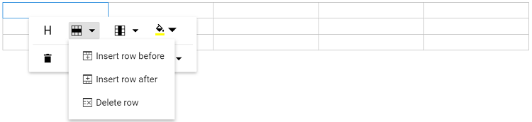
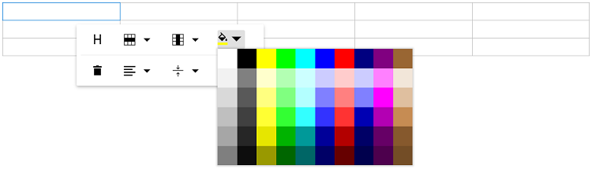
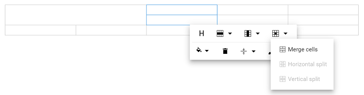
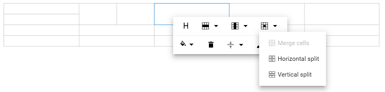

# Table in Angular Rich text editor component

RichTextEditor allows to insert table of content in edit panel and provides an options to add, edit and remove the table as well as perform other table related action. For inserting the table to the Rich Text Editor, the following list of options have been provided in the [`tableSettings`](https://ej2.syncfusion.com/angular/documentation/api/rich-text-editor/tableSettingsModel/)

| Options | Description | Default Value |
|----------------|---------|-----------------------------|
| [minWidth](https://ej2.syncfusion.com/angular/documentation/api/rich-text-editor/tableSettings/#minwidth) | Sets the default minWidth of the table. | 0 |
| [maxWidth](https://ej2.syncfusion.com/angular/documentation/api/rich-text-editor/tableSettings/#maxwidth) | Sets the default maxWidth of the table. | null |
| [resize](https://ej2.syncfusion.com/angular/documentation/api/rich-text-editor/tableSettings/#resize) | Enable resize feature in table.| true |
| [styles](https://ej2.syncfusion.com/angular/documentation/api/rich-text-editor/tableSettings/#styles) | This is an array of key value pair, on each pair, key should be name of styling and value is class name. this list will be shown on quick toolbar options to change the styles of table on designing like dashed, double bordered. | [`TableStyleItems`](https://ej2.syncfusion.com/angular/documentation/api/rich-text-editor/tableSettingsModel/#styles) |
| [width](https://ej2.syncfusion.com/angular/documentation/api/rich-text-editor/tableSettings/#width) | Sets the default width of the table. | 100% |

> To use Table feature, inject `TableService` in the provider section of `AppModule`.

## Insert table

Using the `table` toolbar option, select a number of rows and columns to be inserted over the table grid and insert table into Rich Text Editor content using the mouse.

Tables can also be inserted through the `Insert Table` option in the pop-up where the number of rows and columns can be provided manually,and this is the default way in devices.

In the following sample, the table has been injected from table module.












  


## Quick Toolbar

Quick toolbar will open by clicking on the table. It has different sets of commands to be performed on the table which increases the feasibility to edit the table easily.

> To use quick toolbar feature, inject `QuickToolbarService` in the provider section of `AppModule`.

## Table Header

`Table Header` command is available with quick toolbar option through which the header row can be added or removed from the inserted table. The following image illustrates the table header.

## Insert Rows

`Rows` can be inserted above or below the required table cell through the quick toolbar. Also, focused row can be deleted. The following screenshot shows the available options of the row item.

## Insert Columns

`Columns` can be inserted to the left or right side of the required table cell through the quick toolbar. Also, the focused column can be deleted. The following screenshot shows the available options in inserting column item.

## Set Color

The background color can be set for each table cell through the `background color` command available in quick toolbar.

## Delete Table

Using the delete item in the quick toolbar, users can delete the entire table.

## Vertical Align

Text inside the table can be aligned to top, middle, or bottom using the `tableCellVerticalAlign` tool of the quick toolbar.

## Horizontal Align

Text inside the table can be aligned left, right, or center using the `tableCellHorizontalAlign` tool of the quick toolbar.

## Table Styles

Table styles provided for class name should be appended to a table element. It helps to design the table in specific CSS styles when inserting in the editor.

By Default, provides Dashed border and Alternate rows.

**Dashed border**: Applies the dashed border to the table.

**Alternate border**: Applies the alternative background to the table.

## Table Properties

Sets the default width of the table when it is inserted in the Rich Text Editor using the width of `tableSettings`.

Using the quick toolbar, users can change the width, cell padding, and cell spacing in the selected table using the properties option.

## Table cell merge and split

The Rich Text Editor allows users to change the appearance of the tables by splitting or merging the table cells.

`TableCell` item should be configured in the Table [quickToolbarSettings](https://ej2.syncfusion.com/angular/documentation/api/rich-text-editor/quickToolbarSettings/#table) Property to show the merge/split icons while selecting the table cells

### Table cell merge

The table cell merge feature allows you to merge two or more row and column cells into a single cell with its contents.

The following image explains the table merge action.

### Table cell split

The table cell split feature allows you to a selected cell can be split both horizontally and vertically.

The following image explains the table split action.












  

