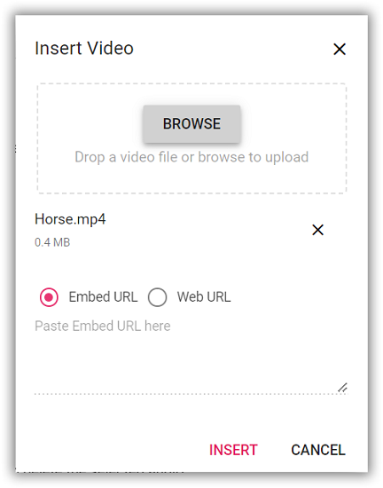

# Video in Angular Rich text editor component

The Rich Text Editor allows you to insert videos from online sources and local computers and then insert them into your content. You can insert the video with the following list of options in the [insertVideoSettings](https://ej2.syncfusion.com/angular/documentation/api/rich-text-editor/#insertvideosettings) property.

| Options | Description |
|----------------|---------|
| allowedTypes | Specifies the extensions of the video types allowed to insert on bowering and passing the extensions with comma separators. For example, pass allowedTypes as `.mp4`, `.mov`, `.wmv` and `.avi`.|
| layoutOption | Sets the default display for a video when it is inserted into the Rich Text Editor. Possible options are: `Inline` and `Break`.|
| saveFormat | Sets the default save format of the video element when inserted. Possible options are: `Blob` and `Base64`.|
| width | Sets the default width of the video when it is inserted in the Rich Text Editor.|
| minWidth | Sets the minWidth of the video element when it is inserted in the Rich Text Editor.|
| maxWidth | Sets the maxWidth of the video element when it is inserted in the Rich Text Editor.|
| height | Sets the default height of the video when it is inserted in the Rich Text Editor.|
| minHeight | Sets the minHeight of the video element when it is inserted in the Rich Text Editor.|
| maxHeight | Sets the maxHeight of the video element when it is inserted in the Rich Text Editor.|
| saveUrl | Provides URL to map the action result method to save the video.|
| removeUrl | Provides URL to map the action result method to remove the video.|
| path | Specifies the location to store the video.|
| resize | Sets the resizing action for the video element.|
| resizeByPercent | Sets the percentage values for the video element with the resizing action.|

## Configure the video tool in the toolbar

You can add the `video` tool in the Rich Text Editor toolbar using the `toolbarSettings` [items](https://ej2.syncfusion.com/angular/documentation/api/rich-text-editor/toolbarSettings/#items) property.

> Rich Text Editor features are segregated into individual feature-wise modules. In this demo, we have used the following injectable services `ToolbarService`, `LinkService`, `HtmlEditorService`, `VideoService` in the `@NgModule.providers section`.

To configure the `Video` toolbar item, refer to the below code.












  


## Insert a video from the web

You can insert a video from either the hosted link or the local machine by clicking the video button in the editor's toolbar. On Clicking the Video button, a dialog opens which allows you to insert video from the Embedded URL or web URL.

### Insert from embed URL

The insert video dialog opens with the `Embed URL` option as default which allows you to insert an embedded URL.


### Insert from web URL

You can switch to `Web URL` by selecting the web URL check box. Inserting with the web URL option will add the video URL as the `src` attribute of the `<source>` tag.


## Insert video from local machine

You can use the `browse` option on the video dialog, to select the video from the local machine and insert it into the Rich Text Editor content.

If the path field is not specified in the [insertVideoSettings](https://ej2.syncfusion.com/angular/documentation/api/rich-text-editor/#insertvideosettings), the video will be converted into the `Blob` URL or `Base64` and inserted inside the Rich Text Editor.

### Restrict video upload based on size

You can restrict the video uploaded from the local machine when the uploaded video file size is greater than the allowed size by using the [fileUploading](https://ej2.syncfusion.com/angular/documentation/api/rich-text-editor/#fileuploading) event.

> The file size in the argument will be returned in `bytes`.

In the following example, the video size has been validated before uploading and determined whether the video has been uploaded or not.

```typescript

import { Component } from '@angular/core';
import { ToolbarService, QuickToolbarService, LinkService, HtmlEditorService, VideoService } from '@syncfusion/ej2-angular-richtexteditor';
import { UploadingEventArgs } from '@syncfusion/ej2-angular-inputs';

@Component( {
    selector: 'app-root',
    template: `<ejs-richtexteditor id='' [toolbarSettings]='toolbarSettings' [insertVideoSettings] = 'insertVideoSettings' (fileUploading) = 'onVideoUpload($event)' >
    </ejs-richtexteditor>`,
    providers: [
        ToolbarService, QuickToolbarService, LinkService, VideoService, HtmlEditorService,
    ],
} )

export class AppComponent {
    public toolbarSettings: object = {
        items: [ 'Video' ]
    };
    public insertVideoSettings: Object = {
        saveUrl: 'https://aspnetmvc.syncfusion.com/services/api/uploadbox/Save',
        path: '../Files/'
    };
    public onVideoUpload = ( args: UploadingEventArgs ) => {
        let sizeInBytes: number = args.fileData.size;
        let fileSize: number = 500000;
        if ( fileSize < sizeInBytes ) {
            args.cancel = true;
        }
    }
}

```

### Server-side action

The selected video can be uploaded to the required destination using the controller action below. Map this method name in [insertVideoSettings.saveUrl](https://ej2.syncfusion.com/angular/documentation/api/rich-text-editor/videoSettingsModel/#saveurl) and provide the required destination path through [insertVideoSettings.path](https://ej2.syncfusion.com/angular/documentation/api/rich-text-editor/videoSettingsModel/#path) properties.

> If you want to insert lower-sized video files in the editor and don't want a specific physical location for saving the video, you can save the format as `Base64`.

In the following code blocks, the video module has been injected and can insert the video files saved in the specified path.

```typescript

import { Component } from '@angular/core';
import { ToolbarService, QuickToolbarService, LinkService, HtmlEditorService, VideoService } from '@syncfusion/ej2-angular-richtexteditor';

@Component( {
    selector: 'app-root',
    template: `<ejs-richtexteditor id='' [toolbarSettings]='toolbarSettings' [insertVideoSettings] = 'insertVideoSettings' >
    </ejs-richtexteditor>`,
    providers: [
        ToolbarService, QuickToolbarService, LinkService, VideoService, HtmlEditorService,
    ],
} )

export class AppComponent {
    public toolbarSettings: object = {
        items: [ 'Video' ]
    };
    public insertVideoSettings: Object = {
        saveUrl: "[SERVICE_HOSTED_PATH]/api/uploadbox/SaveFiles",
        path: "[SERVICE_HOSTED_PATH]/Files/"
    };
}

```

```csharp

using System;
using System.IO;
using FileUpload.Models;
using System.Diagnostics;
using System.Net.Http.Headers;
using Microsoft.AspNetCore.Mvc;
using Microsoft.AspNetCore.Http;
using System.Collections.Generic;
using Microsoft.AspNetCore.Hosting;

namespace FileUpload.Controllers
{
    public class HomeController : Controller
    {
        private IHostingEnvironment hostingEnv;

        public HomeController(IHostingEnvironment env)
        {
            hostingEnv = env;
        }

        public IActionResult Index()
        {
            return View();
        }

        [AcceptVerbs("Post")]
        public void SaveFiles(IList<IFormFile> UploadFiles)
        {
            try
            {
                foreach (IFormFile file in UploadFiles)
                {
                    if (UploadFiles != null)
                    {
                        string filename = ContentDispositionHeaderValue.Parse(file.ContentDisposition).FileName.Trim('"');
                        filename = hostingEnv.WebRootPath + "\\Files" + $@"\{filename}";

                        // Create a new directory, if it does not exists
                        if (!Directory.Exists(hostingEnv.WebRootPath + "\\Files"))
                        {
                            Directory.CreateDirectory(hostingEnv.WebRootPath + "\\Files");
                        }

                        if (!System.IO.File.Exists(filename))
                        {
                            using (FileStream fs = System.IO.File.Create(filename))
                            {
                                file.CopyTo(fs);
                                fs.Flush();
                            }
                            Response.StatusCode = 200;
                        }
                    }
                }
            }
            catch (Exception)
            {
                Response.StatusCode = 204;
            }
        }

        [ResponseCache(Duration = 0, Location = ResponseCacheLocation.None, NoStore = true)]
        public IActionResult Error()
        {
            return View(new ErrorViewModel { RequestId = Activity.Current?.Id ?? HttpContext.TraceIdentifier });
        }
    }
}

```

### Video save format

The video files can be saved as `Blob` or `Base64` URL by using the [insertVideoSettings.saveFormat](https://ej2.syncfusion.com/angular/documentation/api/rich-text-editor/videoSettingsModel/#saveformat) property, which is of enum type, and the generated URL will be set to the `src` attribute of the `<source>` tag.

> The default `saveFormat` property is set to `Blob` format.

```HTML

<video>
    <source src="blob:http://ej2.syncfusion.com/3ab56a6e-ec0d-490f-85a5-f0aeb0ad8879" type="video/mp4" >
</video>

<video>
    <source src="data:video/mp4;base64,iVBORw0KGgoAAAANSUhEUgAAADAAAAAwCAYAAABXAvmHA" type="video/mp4" >
</video>

```

## Replacing video

Once a video file has been inserted, you can replace it using the Rich Text Editor [quickToolbarSettings](https://ej2.syncfusion.com/angular/documentation/api/rich-text-editor/quickToolbarSettings/#quicktoolbarsettings) `videoReplace` option. You can replace the video file either by using the embedded URL or the web URL and the browse option in the video dialog.


## Delete video

To remove a video from the Rich Text Editor content, select the video and click the `videoRemove` button from the quick toolbar. It will delete the video from the Rich Text Editor content as well as from the service location if the [insertVideoSettings.removeUrl](https://ej2.syncfusion.com/angular/documentation/api/rich-text-editor/videoSettingsModel/#removeurl) is given.

Once you select the video from the local machine, the URL for the video will be generated. You can remove the video from the service location by clicking the cross icon.



## Dimension

Set the default width, minWidth, height, and minHeight of the video element, when it is inserted in the Rich Text Editor using the [width](https://ej2.syncfusion.com/angular/documentation/api/rich-text-editor/videoSettings/#width), [minWidth](https://ej2.syncfusion.com/angular/documentation/api/rich-text-editor/videoSettings/#minwidth), [height](https://ej2.syncfusion.com/angular/documentation/api/rich-text-editor/videoSettings/#height), [minHeight](https://ej2.syncfusion.com/angular/documentation/api/rich-text-editor/videoSettings/#minheight) properties.

Through the [quickToolbarSettings](https://ej2.syncfusion.com/angular/documentation/api/rich-text-editor/quickToolbarSettings/#quicktoolbarsettings), also you can change the width and height using  the `Change Size` button. Once you click on the button, the video size dialog will open as below. In that, specify the width and height of the video in pixels.


## Display position

Sets the default display property for the video when it is inserted in the Rich Text Editor using the [insertVideoSettings.layoutOption](https://ej2.syncfusion.com/angular/documentation/api/rich-text-editor/videoSettings/#layoutOption) property. It has two possible options: `Inline` and `Break`. When updating the display positions, it updates the video elements’ layout position.

> The default `layoutOption` property is set to `Inline`.

```typescript

import { Component } from '@angular/core';
import { ToolbarService, QuickToolbarService, LinkService, HtmlEditorService, VideoService } from '@syncfusion/ej2-angular-richtexteditor';

@Component( {
    selector: 'app-root',
    template: `<ejs-richtexteditor id='' [toolbarSettings]='toolbarSettings' [insertVideoSettings] = 'insertVideoSettings'>
    </ejs-richtexteditor>`,
    providers: [
        ToolbarService, QuickToolbarService, LinkService, VideoService, HtmlEditorService,
    ],
} )
export class AppComponent {
    public toolbarSettings: object = {
        items: [ 'Video' ]
    };
    public insertVideoSettings: Object = {
      layoutOption: 'Break'
    };
}

```

## Resize video

The Rich Text Editor has built-in video resizing support, which is enabled for the video elements added. The resize points will appear on each corner of the video when focusing so users can easily resize the video using mouse points or thumb through the resize points. Also, the resize calculation will be done based on the aspect ratio.

You can disable the resize action by configuring `false` for the [insertVideoSettings.resize](https://ej2.syncfusion.com/angular/documentation/api/rich-text-editor/videoSettingsModel/#resize) property.

> If the [minWidth](https://ej2.syncfusion.com/angular/documentation/api/rich-text-editor/videoSettings/#minwidth) and [minHeight](https://ej2.syncfusion.com/angular/documentation/api/rich-text-editor/videoSettings/#minheight) properties are configured, the video resizing does not shrink below the specified values.


## Rename video before inserting

You can use the [insertVideoSettings](https://ej2.syncfusion.com/angular/documentation/api/rich-text-editor#insertvideosettings) property, to specify the server handler to upload the selected video. Then by binding the [fileUploadSuccess](https://ej2.syncfusion.com/angular/documentation/api/rich-text-editor/#fileuploadsuccess) event, you can receive the modified file name from the server and update it in the Rich Text Editor's insert video dialog.

```HTML

<ejs-richtexteditor id='' [toolbarSettings]='toolbarSettings' [insertVideoSettings] = 'insertVideoSettings' (fileUploadSuccess) = 'onVideoUploadSuccess($event)' >
<ng-template #valueTemplate>
   <p>The Rich Text Editor is WYSIWYG ("what you see is what you get") editor useful to create and edit content, and return the valid <a href="https://ej2.syncfusion.com/home/" target="_blank">HTML markup</a> or <a href="https://ej2.syncfusion.com/home/" target="_blank">markdown</a> of the content</p>
</ng-template>
</ejs-richtexteditor>

```

```typescript

import { Component } from '@angular/core';
import { ToolbarService, QuickToolbarService, LinkService, HtmlEditorService, VideoService,} from '@syncfusion/ej2-angular-richtexteditor';

@Component({
  selector: 'app-root',
  templateUrl: `app.component.html`,
  providers: [ ToolbarService, QuickToolbarService, LinkService, VideoService, HtmlEditorService ],
})
export class AppComponent {
    public toolbarSettings: object = {
        items: ['Video'],
    };
    public insertVideoSettings: Object = {
        saveUrl: "[SERVICE_HOSTED_PATH]/api/uploadbox/Rename",
        path: "[SERVICE_HOSTED_PATH]/Files/"
    };
    public onVideoUploadSuccess = (args: any) => {
            alert("Get the new file name here");
            if( args.e.currenTarget.getResponseHeader('name') != null ){
                args.file.name = args.e.currentTarget.getResponseHeader('name');
                let fileName : any = document.querySelector(".e-file-name")[0];
                fileName.innerHTML = args.fileData.name.replace(document.querySelectorAll(".e-file-type")[0].innerHTML , '');
                fileName.title = args.fileData.name;
            }
    };
}

```

To configure server-side handler, refer to the below code.

```csharp
int x = 0;
string file;
[AcceptVerbs("Post")]
public void Rename()
{
    try
    {
        var httpPostedFile = System.Web.HttpContext.Current.Request.Files["UploadFiles"];
        fileName = httpPostedFile.FileName;
        if (httpPostedFile != null)
        {
            var fileSave = System.Web.HttpContext.Current.Server.MapPath("~/Files");
            if (!Directory.Exists(fileSave))
            {
                Directory.CreateDirectory(fileSave);
            }
            var fileName = Path.GetFileName(httpPostedFile.FileName);
            var fileSavePath = Path.Combine(fileSave, fileName);
            while (System.IO.File.Exists(fileSavePath))
            {
                fileName = "rteFiles" + x + "-" + fileName;
                fileSavePath = Path.Combine(fileSave, fileName);
                x++;
            }
            if (!System.IO.File.Exists(fileSavePath))
            {
                httpPostedFile.SaveAs(fileSavePath);
                HttpResponse Response = System.Web.HttpContext.Current.Response;
                Response.Clear();
                Response.Headers.Add("name", fileName);
                Response.ContentType = "application/json; charset=utf-8";
                Response.StatusDescription = "File uploaded succesfully";
                Response.End();
            }
        }
    }
    catch (Exception e)
    {
        HttpResponse Response = System.Web.HttpContext.Current.Response;
        Response.Clear();
        Response.ContentType = "application/json; charset=utf-8";
        Response.StatusCode = 204;
        Response.Status = "204 No Content";
        Response.StatusDescription = e.Message;
        Response.End();
    }
}

```

## Upload video with authentication

You can add additional data with the video uploaded from the Rich Text Editor on the client side, which can even be received on the server side by using the [fileUploading](https://ej2.syncfusion.com/angular/documentation/api/rich-text-editor/#fileuploading) event and its `customFormData` argument, you can pass parameters to the controller action. On the server side, you can fetch the custom headers by accessing the form collection from the current request, which retrieves the values sent using the POST method.

> By default, it doesn't support the `UseDefaultCredentials` property, you can manually append the default credentials with the upload request.

```typescript

import { Component } from '@angular/core';
import { ToolbarService, QuickToolbarService, LinkService, HtmlEditorService, VideoService,} from '@syncfusion/ej2-angular-richtexteditor';
import { UploadingEventArgs } from '@syncfusion/ej2-angular-inputs';

@Component({
  selector: 'app-root',
  template: `<ejs-richtexteditor id='' [toolbarSettings]='toolbarSettings' [insertVideoSettings] = 'insertVideoSettings' (fileUploading) = 'onVideoUpload($event)' >
    </ejs-richtexteditor>`,
  providers: [ ToolbarService, QuickToolbarService, LinkService, VideoService, HtmlEditorService ],
})
export class AppComponent {
  public toolbarSettings: object = {
    items: ['Video'],
  };
  public insertVideoSettings: Object = {
    saveUrl: "[SERVICE_HOSTED_PATH]/api/uploadbox/SaveFiles",
    path: "[SERVICE_HOSTED_PATH]/Files/"
  };
  public onVideoUpload = (args: UploadingEventArgs) => {
    let accessToken = "Authorization_token";
    // adding custom form Data
    args.customFormData = [ { 'Authorization': accessToken}];
  };
}

```

```csharp

public void SaveFiles(IList<IFormFile> UploadFiles)
{
    string currentPath = Request.Form["Authorization"].ToString();
}

```

## See Also

* [How to edit the quick toolbar settings](./toolbar/#quick-inline-toolbar)
* [How to use the link editing option in the toolbar items](./link/)
