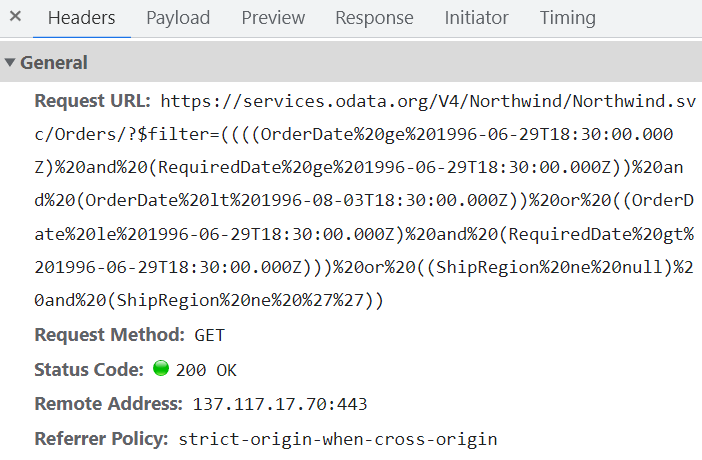

# Data binding in Angular Schedule component

The Scheduler uses `DataManager`, which supports both RESTful data service binding and JavaScript object array binding. The [`dataSource`](https://ej2.syncfusion.com/angular/documentation/api/schedule/eventSettings#datasource) property of Scheduler can be assigned either with the instance of `DataManager` or JavaScript object array collection, as it supports the following two kind of data binding methods:

* Local data
* Remote data

## Binding local data

To bind local JSON data to the Scheduler, you can simply assign a JavaScript object array to the [`dataSource`](https://ej2.syncfusion.com/angular/documentation/api/schedule/eventSettings#datasource) option of the scheduler within the `eventSettings` property. The JSON object dataSource can also be provided as an instance of `DataManager` and assigned to the Scheduler `dataSource` property.












  


> By default, `DataManager` uses `JsonAdaptor` for binding local data.

You can also bind different field names to the default event fields as well as include additional custom fields to the event object collection which can be referred [here](./appointments/#event-fields).

## Binding remote data

Any kind of remote data services can be bound to the Scheduler. To do so, create an instance of `DataManager` and provide the service URL to the `url` option of `DataManager` and then assign it to the [`dataSource`](https://ej2.syncfusion.com/angular/documentation/api/schedule/eventSettings#datasource) property within `eventSettings`.

### Using ODataV4Adaptor

[ODataV4](https://www.odata.org/documentation/) is a standardized protocol for creating and consuming data. Refer to the following code example to retrieve the data from ODataV4 service using the DataManager. To connect with ODataV4 service end points, it is necessary to make use of `ODataV4Adaptor` within `DataManager`.












  


### Filter events using the in-built query

To enable server-side filtering operations based on predetermined conditions, the [`includeFiltersInQuery`](https://helpej2.syncfusion.com/angular/documentation/api/schedule/eventSettingsModel/#includefiltersinquery) API can be set to true, this allows the filter query to be constructed using the start date, end date, and recurrence rule which in turn enables the request to be filtered accordingly.

This method greatly improves the component's performance by reducing the data that needs to be transferred to the client side. As a result, the component's efficiency and responsiveness are significantly enhanced, resulting in a better user experience. However, it is important to consider the possibility of longer query strings, which may cause issues with the maximum URL length or server limitations on query string length.












  


The following image represents how the parameters are passed using ODataV4 filter.



### Using custom adaptor

It is possible to create your own custom adaptor by extending the built-in available adaptors. The following example demonstrates the custom adaptor usage and how to add a custom field `EventID` for the appointments by overriding the built-in response processing using the `processResponse` method of the `ODataV4Adaptor`.












  


## Loading data via AJAX post

You can bind the event data through external ajax request and assign it to the `dataSource`property of Scheduler. In the following code example, we have retrieved the data from server with the help of ajax request and assigned the resultant data to the `dataSource` property of Scheduler within the `onSuccess` event of Ajax.

`[src/app/app.ts]`

```typescript
import { Component, OnInit, ViewChild } from "@angular/core";
import { Ajax } from "@syncfusion/ej2-base";
import { DataManager, UrlAdaptor, Query } from "@syncfusion/ej2-data";
import { EventSettingsModel, View, EventRenderedArgs, DayService, WeekService, WorkWeekService, MonthService AgendaService, ResizeService, DragAndDropService, ScheduleComponent } from "@syncfusion/ej2-angular-schedule";

@Component({
  selector: "app-root",
  templateUrl: "app/app.component.html",
  providers: [ DayService, WeekService, WorkWeekService, MonthService, AgendaService, ResizeService,
DragAndDropService ]
})
export class AppComponent implements OnInit {
  @ViewChild("scheduleObj") public scheduleObj: ScheduleComponent;
  ngOnInit(): void {}

  public currentDate: Date = new Date(2017, 5, 5);
  onCreate() {
    const scheduleObj = this.scheduleObj; // Schedule instance
    const ajax = new Ajax(
      "https://ej2services.syncfusion.com/production/web-services/api/Schedule",
      "GET"
    );
    ajax.send();
    ajax.onSuccess = (data: string) => {
      scheduleObj.eventSettings.dataSource = JSON.parse(data);
    };
  }
}
```

> Definition for the controller method `GetData` can be referred [here](#scheduler-crud-actions).

## Passing additional parameters to the server

To send an additional custom parameter to the server-side post, you need to make use of the `addParams` method of `Query`. Now, assign this `Query` object with additional parameters to the [`query`](https://ej2.syncfusion.com/angular/documentation/api/schedule/eventSettings/#query) property of Scheduler.












  


> The parameters added using the [`query`](https://ej2.syncfusion.com/angular/documentation/api/schedule/eventSettings/#query) property will be sent along with the data request sent to the server on every scheduler actions.

## Handling failure actions

During the time of Scheduler interacting with server, there are chances that some server-side exceptions may occur. You can acquire those error messages or exception details in client-side using the [`actionFailure`](https://ej2.syncfusion.com/angular/documentation/api/schedule#actionfailure) event of Scheduler.

The argument passed to the [`actionFailure`](https://ej2.syncfusion.com/angular/documentation/api/schedule#actionfailure) event contains the error details returned from the server.












  


> The [`actionFailure`](https://ej2.syncfusion.com/angular/documentation/api/schedule#actionfailure) event will be triggered not only on server returning errors, but also when there is an exception while processing any of the Scheduler CRUD actions.

## Scheduler CRUD actions

The CRUD (Create, Read, Update and Delete) actions can be performed easily on Scheduler appointments using the various adaptors available within the `DataManager`. Most preferably, we will be using `UrlAdaptor` for performing CRUD actions on scheduler appointments.

```typescript
import { Component } from '@angular/core';
import { EventSettingsModel, DayService, WeekService, WorkWeekService, MonthService, AgendaService } from '@syncfusion/ej2-angular-schedule';
import { DataManager, UrlAdaptor } from '@syncfusion/ej2-data';

@Component({
  selector: 'app-root',
  providers: [DayService, WeekService, WorkWeekService, MonthService, AgendaService],
  // specifies the template string for the Schedule component
  template: `<ejs-schedule width='100%' height='550px' [readonly]="readonly" [selectedDate]="selectedDate" [eventSettings]="eventSettings"></ejs-schedule>`
})

export class AppComponent {
    public selectedDate: Date = new Date(2017, 5, 11);
    private dataManager: DataManager = new DataManager({
       url: 'Home/GetData', // 'controller/actions'
       crudUrl: 'Home/UpdateData',
       adaptor: new UrlAdaptor
    });
    public eventSettings: EventSettingsModel = { dataSource: this.dataManager };
}
```

The server-side controller code to handle the CRUD operations are as follows.

```c#
using System;
using System.Collections.Generic;
using System.Linq;
using System.Web;
using System.Web.Mvc;
using ScheduleSample.Models;

namespace ScheduleSample.Controllers
{
    public class HomeController : Controller
    {
        ScheduleDataDataContext db = new ScheduleDataDataContext();
        public ActionResult Index()
        {
            return View();
        }
        public JsonResult LoadData()  // Here we get the Start and End Date and based on that can filter the data and return to Scheduler
        {
            var data = db.ScheduleEventDatas.ToList();
            return Json(data, JsonRequestBehavior.AllowGet);
        }
        [HttpPost]
        public JsonResult UpdateData(EditParams param)
        {
            if (param.action == "insert" || (param.action == "batch" && param.added != null)) // this block of code will execute while inserting the appointments
            {
                var value = (param.action == "insert") ? param.value : param.added[0];
                int intMax = db.ScheduleEventDatas.ToList().Count > 0 ? db.ScheduleEventDatas.ToList().Max(p => p.Id) : 1;
                DateTime startTime = Convert.ToDateTime(value.StartTime);
                DateTime endTime = Convert.ToDateTime(value.EndTime);
                ScheduleEventData appointment = new ScheduleEventData()
                {
                    Id = intMax + 1,
                    StartTime = startTime.ToLocalTime(),
                    EndTime = endTime.ToLocalTime(),
                    Subject = value.Subject,
                    IsAllDay = value.IsAllDay,
                    StartTimezone = value.StartTimezone,
                    EndTimezone = value.EndTimezone,
                    RecurrenceRule = value.RecurrenceRule,
                    RecurrenceID = value.RecurrenceID,
                    RecurrenceException = value.RecurrenceException
                };
                db.ScheduleEventDatas.InsertOnSubmit(appointment);
                db.SubmitChanges();
            }
            if (param.action == "update" || (param.action == "batch" && param.changed != null)) // this block of code will execute while updating the appointment
            {
                var value = (param.action == "update") ? param.value : param.changed[0];
                var filterData = db.ScheduleEventDatas.Where(c => c.Id == Convert.ToInt32(value.Id));
                if (filterData.Count() > 0)
                {
                    DateTime startTime = Convert.ToDateTime(value.StartTime);
                    DateTime endTime = Convert.ToDateTime(value.EndTime);
                    ScheduleEventData appointment = db.ScheduleEventDatas.Single(A => A.Id == Convert.ToInt32(value.Id));
                    appointment.StartTime = startTime.ToLocalTime();
                    appointment.EndTime = endTime.ToLocalTime();
                    appointment.StartTimezone = value.StartTimezone;
                    appointment.EndTimezone = value.EndTimezone;
                    appointment.Subject = value.Subject;
                    appointment.IsAllDay = value.IsAllDay;
                    appointment.RecurrenceRule = value.RecurrenceRule;
                    appointment.RecurrenceID = value.RecurrenceID;
                    appointment.RecurrenceException = value.RecurrenceException;
                }
                db.SubmitChanges();
            }
            if (param.action == "remove" || (param.action == "batch" && param.deleted != null)) // this block of code will execute while removing the appointment
            {
                if (param.action == "remove")
                {
                    int key = Convert.ToInt32(param.key);
                    ScheduleEventData appointment = db.ScheduleEventDatas.Where(c => c.Id == key).FirstOrDefault();
                    if (appointment != null) db.ScheduleEventDatas.DeleteOnSubmit(appointment);
                }
                else
                {
                    foreach (var apps in param.deleted)
                    {
                        ScheduleEventData appointment = db.ScheduleEventDatas.Where(c => c.Id == apps.Id).FirstOrDefault();
                        if (appointment != null) db.ScheduleEventDatas.DeleteOnSubmit(appointment);
                    }
                }
                db.SubmitChanges();
            }
            var data = db.ScheduleEventDatas.ToList();
            return Json(data, JsonRequestBehavior.AllowGet);
        }

        public class EditParams
        {
            public string key { get; set; }
            public string action { get; set; }
            public List<ScheduleEventData> added { get; set; }
            public List<ScheduleEventData> changed { get; set; }
            public List<ScheduleEventData> deleted { get; set; }
            public ScheduleEventData value { get; set; }
        }
    }
}
```

## Configuring Scheduler with Google API service

We have assigned our custom created Google Calendar url to the DataManager and assigned the same to the Scheduler `dataSource`. Since the events data retrieved from the Google Calendar will be in its own object format, therefore it needs to be resolved manually within the Scheduler’s `dataBinding` event. Within this event, the event fields needs to be mapped properly and then assigned to the result.












  


> You can refer to our [Angular Scheduler](https://www.syncfusion.com/angular-ui-components/angular-scheduler) feature tour page for its groundbreaking feature representations. You can also explore our [Angular Scheduler example](https://ej2.syncfusion.com/angular/demos/#/material/schedule/overview) to knows how to present and manipulate data.
