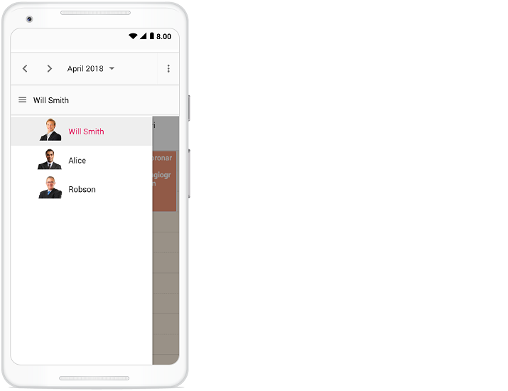
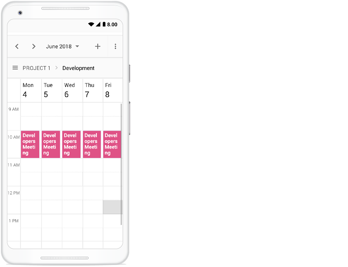

# Resources in Angular Schedule component

Resources and grouping support allows the Scheduler to be shared by multiple resources. Also, the appointments of each resources are displayed under relevant resources. Each resource in the Scheduler is arranged in a column/row wise order, with individual spacing to display all its respective appointments on a single page. It also supports the multiple levels of grouping of resources, thus enabling the categorization of resources in a hierarchical structure and shows it either in expandable groups (Timeline views) or else vertical hierarchy one after the other (Calendar views).

It is also possible to assign one or more resources to the same appointment, by allowing multiple selection of resource options available in the event editor window.

The HTML5 JavaScript Scheduler groups the resources based on different criteria. It includes grouping appointments based on resources, grouping resources based on dates, and timeline scheduling. Also, the data for resources bind with Scheduler either as a local JSON collection or URL, retrieving data from remote data services.

Learn how to add appointments of multiple resources to the Angular Scheduler from this video:



## Resource fields

The default options available within the `resources` collection are as follows,

| Field name |  Type   |   Description   |
|------------|---------|---------------- |
| `field` | String | A value that binds to the resource field of event object. |
| `title` | String | It holds the title of the resource field to be displayed on the event editor window. |
| `name` | String | A unique resource name used for differentiating various resource objects while grouping. |
| `allowMultiple` | Boolean | When set to `true`, allows multiple selection of resource names, thus creating multiple instances of same appointment for the selected resources. |
| `dataSource` | Object | Assigns the resource `dataSource`, where data can be passed either as an array of JavaScript objects, or else can create an instance of [`DataManager`](http://ej2.syncfusion.com/documentation/data/api-dataManager.html) in case of processing remote data and can be assigned to the `dataSource` property. With the remote data assigned to `dataSource`, check the available [adaptors](http://ej2.syncfusion.com/documentation/data/adaptors.html) to customize the data processing. |
| `query` | Query | Defines the external [`query`](http://ej2.syncfusion.com/documentation/data/api-query.html) that will be executed along with the data processing. |
| `idField` | String | Binds the resource ID field name from the resources `dataSource`. |
| `textField` | String | Binds the text field name from the resources `dataSource`. It usually holds the resource names. |
| `groupIDField` | String | Binds the group ID field name from the resource `dataSource`. It usually holds the value of resource IDs of parent level resources. |
| `colorField` | String | Binds the color field name from the resource `dataSource`. The color value mapped in this field will be applied to the events of resources. |
| `startHourField` | String | Binds the start hour field name from the resource `dataSource`. It allows to provide different work start hour for the resources. |
| `endHourField` | String | Binds the end hour field name from the resource `dataSource`. It allows to provide different work end hour for the resources. |
| `workDaysField` | String | Binds the work days field name from the resources `dataSource`. It allows to provide different working days collection for the resources. |
| `cssClassField` | String | Binds the custom CSS class field name from the resources `dataSource`. It maps the CSS class written for the specific resources and applies it to the events of those resources. |

## Resource data binding

The data for resources can bind with Scheduler either as a local JSON collection or a service URL, retrieving resource data from remote data services.

### Using local JSON data

The following code example depicts how to bind the local JSON data to the `dataSource` of `resources` collection.

```typescript
import { Component } from '@angular/core';
import {
    WeekService, MonthService, AgendaService, TimelineViewsService, TimelineMonthService, EventSettingsModel
} from '@syncfusion/ej2-angular-schedule';
import { resourceData } from './datasource.ts';

@Component({
    selector: "app-root",
    providers: [WeekService, MonthService, AgendaService, TimelineViewsService, TimelineMonthService],
    // specifies the template string for the Schedule component
    template: `
    <ejs-schedule width="100%" height="550px" [selectedDate]="selectedDate" [views]="views"
      [eventSettings]="eventSettings">
      <e-resources>
        <e-resource field="OwnerId" title="Owner" name="Owners"
          [dataSource]="ownerDataSource" [allowMultiple]="allowMultipleOwner"
          textField="OwnerText" idField="Id" colorField="OwnerColor">
        </e-resource>
      </e-resources>
    </ejs-schedule>`
})
export class AppComponent {
    public selectedDate: Date = new Date(2018, 3, 1);
    public views: Array<string> = ['Week', 'Month', 'TimelineWeek', 'TimelineMonth', 'Agenda'];
    public eventSettings: EventSettingsModel = {
        dataSource: resourceData
    };
    public allowMultipleOwner: Boolean = true;
    public ownerDataSource: Object[] = [
        { OwnerText: 'Nancy', Id: 1, OwnerColor: '#ffaa00' },
        { OwnerText: 'Steven', Id: 2, OwnerColor: '#f8a398' },
        { OwnerText: 'Michael', Id: 3, OwnerColor: '#7499e1' }
    ];
}
```

### Using remote service URL

The following code example depicts how to bind the remote data for resources `dataSource`.

```typescript
import { Component } from '@angular/core';
import {
    WeekService, MonthService, AgendaService, TimelineViewsService, TimelineMonthService, EventSettingsModel
} from '@syncfusion/ej2-angular-schedule';
import { resourceData } from './datasource.ts';
import { DataManager, UrlAdaptor } from '@syncfusion/ej2-data';

@Component({
    selector: "app-root",
    providers: [WeekService, MonthService, AgendaService, TimelineViewsService, TimelineMonthService],
    // specifies the template string for the Schedule component
    template: `
    <ejs-schedule width="100%" height="550px" [selectedDate]="selectedDate" [views]="views"
      [eventSettings]="eventSettings">
      <e-resources>
        <e-resource field="OwnerId" title="Owner" name="Owners"
          [dataSource]="resourceDataManager" [allowMultiple]="allowMultipleOwner"
          textField="OwnerText" idField="Id" colorField="OwnerColor">
        </e-resource>
      </e-resources>
    </ejs-schedule>`
})
export class AppComponent {
    public selectedDate: Date = new Date(2018, 3, 1);
    public views: Array<string> = ['Week', 'Month', 'TimelineWeek', 'TimelineMonth', 'Agenda'];
    public resourceDataManager: DataManager = new DataManager({
        url: 'Home/GetResourceData',
        adaptor: new UrlAdaptor,
        crossDomain: true
    });
    public eventSettings: EventSettingsModel = {
        dataSource: resourceData
    };
    public allowMultipleOwner: Boolean = true;
}
```

## Scheduler with multiple resources

It is possible to display the Scheduler in default mode without visually showcasing all the resources in it, but allowing to assign the required resources to the appointments through the event editor resource options.

The appointments belonging to the different resources will be displayed altogether on the default Scheduler, which will be differentiated based on the resource color assigned in the **resources** (depicting to which resource that particular appointment belongs) collection.

**Example:** To display default Scheduler with multiple resource options in the event editor, ignore the group option and simply define the `resources` property with all its internal options.












  



> Setting `allowMultiple` to `true` in the above code example allows you to select multiple resources from the event editor and also creates multiple copies of the same appointment in the Scheduler for each resources while rendering.

## Resource grouping

Resource grouping support allows the Scheduler to group the resources in a hierarchical structure both as an expandable groups (Timeline views) and as vertical hierarchy displaying resources one after the other (Resources view).

Scheduler supports both single and multiple levels of resource grouping that can be customized both in timeline and vertical Scheduler views.

Explore the advanced options available with the multiple resources and grouping concepts of Angular Scheduler by watching this video:



### Vertical resource view

The following code example displays how the multiple resources are grouped and its events are portrayed in the default calendar views.












  



### Timeline resource view

The following code example depicts how to group the multiple resources on Timeline Scheduler views and its relevant events are displayed accordingly under those resources.












  



### Grouping single-level resources

This kind of grouping allows the Scheduler to display all the resources at a single level simultaneously. The appointments mapped under resources will be displayed with the colors as per the `colorField` defined on the resources collection.

**Example:** To display the Scheduler with single level resource grouping,












  



> The `name` field defined in the **resources** collection namely `Owners` will be mapped within the `group` property, in order to enable the grouping option with those resource levels on the Scheduler.

### Grouping multi-level resources

It is possible to group the resources of Scheduler in multiple levels, by mapping the child resources to each parent resource. In the following example, there are 2 levels of resources, on which the second level resources are defined with `groupID` mapping to the first level resource's ID so as to establish the parent-child relationship between them.

**Example:** To display the Scheduler with multiple level resource grouping options,












  



### One-to-One grouping

In multi-level grouping, Scheduler usually groups the resources on the child level based on the `GroupID` that maps with the `Id` field of parent level resources (as `byGroupID` set to true by default). There are also option which allows you to group all the child resource(s) against each of its parent resource(s). To enable this kind of grouping, set `false` to the `byGroupID` option within the `group` property. In the following code example, there are two levels of resources, on which all the 3 resources at the child level is mapped one to one with each resource on the first level.












  



### Grouping resources by date

It groups the number of resources under each date and is applicable only on the calendar views such as Day, Week, Work Week, Month, Agenda and Month-Agenda. To enable such grouping, set `byDate` option to `true` within the `group` property.

**Example:** To display the Scheduler with resources grouped by date,












  



> This kind of grouping by date is not applicable on any of the timeline views.

## Customizing parent resource cells

In timeline view work cells of parent resource can be customized by checking the `elementType` as `resourceGroupCells` in the event `renderCell`. In the following code example, background color of the work hours has been changed.












  


## Working with shared events

Multiple resources can share the same events, thus allowing the CRUD action made on it to reflect on all other shared instances simultaneously. To enable such option, set `allowGroupEdit` option to `true` within the `group` property. With this property enabled, a single appointment
object will be maintained within the appointment collection, even if it is shared by more than one resource – whereas the resource fields of such appointment object will be in array which hold the IDs of the multiple resources.

> Any actions such as create, edit or delete held on any one of the shared event instances, will be reflected on all other related instances visible on the UI.

**Example:** To edit all the resource events simultaneously,












  



## Simple resource header customization

It is possible to customize the resource header cells using built-in template option and change the look and appearance of it in both the vertical and timeline view modes. All the resource related fields and other information can be accessed within the resource header template option.

**Example:** To customize the resource header and display it along with designation field, refer the below code example.












  



> To customize the resource header in compact mode properly make use of the class `e-device` as in the code example.



## Customizing resource header with multiple columns

It is possible to customize the resource headers to display with multiple columns such as Room, Type and Capacity. The following code example depicts the way to achieve it and is applicable only on timeline views.












  



## Displaying tooltip for resource headers

It is possible to display tooltips over the resource headers showing the resource information. By default, there won't be any tooltips displayed on the resource headers, and to enable it, you need to assign the customized template design to the `headerTooltipTemplate` option within the `group` property.












  



## Choosing among resource colors for appointments

By default, the colors defined on the top level resources collection will be applied for the events. In case, if you want to apply specific resource color to events irrespective of its top-level parent resource color, it can be achieved by defining `resourceColorField` option within the `eventSettings` property.

In the following example, the colors mentioned in the second level will get applied over the events.












  



> The value of the `resourceColorField` field should be mapped with the `name` value given within the `resources` property.

## Dynamically add and remove resources

It is possible to add or remove the resources dynamically to and from the Scheduler respectively. In the following example, when the checkboxes are checked and unchecked, the respective resources gets added up or removed from the Scheduler layout. To add new resource dynamically, `addResource` method is used which accepts the arguments such as resource object, resource name (within which level, the resource object to be added) and index (position where the resource needs to be added).

To remove the resources dynamically, `removeResource` method is used which accepts the index (position from where the resource to be removed) and resource name (within which level, the resource object presents) as parameters.












  


## Setting different working days and hours for resources

Each resource in the Scheduler can have different working hours as well as different working days set to it. There are default options available within the `resources` collection, to customize the default working hours and days of the Scheduler.

### Set different work days

Different working days can be set for the resources of Scheduler using the `workDaysField` property which maps the working days field from the resource dataSource. This field accepts the collection of day indexes (from 0 to 6) of a week. By default, it is set to [1, 2, 3, 4, 5] and in the following example, each resource has been set with different values and therefore each of them will render only those working days. This option is applicable only on the calendar views and is not applicable on timeline views.












  



### Set different work hours

Working hours indicates the work hour duration of a day, which is highlighted visually with active color over the work cells. Each resource on the Scheduler can be defined with its own set of working hours as depicted in the following example.

* `startHourField` - Denotes the start time of the working/business hour in a day.
* `endHourField` - Denotes the end time limit of the working/business hour in a day.












  



In this example, a resource named `Will Smith` is depicted with working hours ranging from 8.00 AM to 3.00 PM and is visually illustrated with active colors, whereas the other two resources have different working hours set.

## Hide non-working days when grouped by date

In Scheduler, you can set custom work days for each resource and group the Scheduler by date to display these work days. By default, the Scheduler will show all days when it is grouped by date, even if they are not included in the custom work days for the resources. However, you can use the [`hideNonWorkingDays`](../api/schedule/group/#hidenonworkingdays) property to only display the custom work days in the Scheduler.

To use the [`hideNonWorkingDays`](../api/schedule/group/#hidenonworkingdays) property, you need to include it in the configuration options for your Scheduler component. Set the value of [`hideNonWorkingDays`](../api/schedule/group/#hidenonworkingdays) to `true` to enable this feature.

**Example:** To display the Scheduler with resources grouped by date for custom working days,












  



> The [`hideNonWorkingDays`](../api/schedule/group/#hidenonworkingdays) property only applies when the Scheduler is grouped [`byDate`](../api/schedule/group/#bydate).

## Compact view in mobile

Although the Scheduler views are designed keeping in mind the responsiveness of the control in mobile devices, however when using Scheduler with multiple resources - it is difficult to view all the resources and its relevant events at once on the mobile. Therefore, we have introduced a new compact mode specially for displaying multiple resources of Scheduler on mobile devices. By default, this mode is enabled while using Scheduler with multiple resources on mobile devices. If in case, you need to disable this compact mode, set `false` to the `enableCompactView` option within the `group` property. Disabling this option will display the exact desktop mode of Scheduler view on mobile devices.

With this compact view enabled on mobile, you can view only single resource at a time and to switch to other resources, there is a treeview at the left listing out all other available resources - clicking on which will display that particular resource and its related appointments.



Clicking on the menu icon before the resource text will show the resources available in the Scheduler as following.


## Adaptive UI in desktop

By default, the Scheduler layout adapts automatically in the desktop and mobile devices with appropriate UI changes. In case, if the user wants to display the Adaptive scheduler in desktop mode with adaptive enhancements, then the property `enableAdaptiveUI` can be set to true. Enabling this option will display the exact mobile mode of Scheduler view on desktop devices.

Some of the default changes made for compact Scheduler to render in desktop devices are as follows,
* View options displayed in the Navigation drawer.
* Plus icon is added to the header for new event creation.
* Today icon is added to the header instead of the Today button.
* With Multiple resources – only one resource has been shown to enhance the view experience of resource events details clearly. To switch to other resources, there is a TreeView on the left that lists all other available resources, clicking on which will display that particular resource and its related events.












  



> You can refer to our [Angular Scheduler](https://www.syncfusion.com/angular-ui-components/angular-scheduler) feature tour page for its groundbreaking feature representations. You can also explore our [Angular Scheduler example](https://ej2.syncfusion.com/angular/demos/#/material/schedule/overview) to knows how to present and manipulate data.
