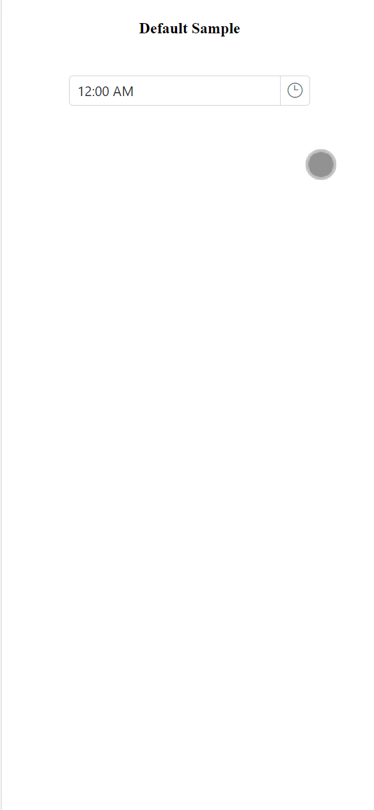

# Style appearance in Angular Timepicker component

The following content provides the exact CSS structure that can be used to modify the control's appearance based on the user preference.

## Customizing the appearance of TimePicker wrapper element

Use the following CSS to customize the appearance of wrapper element.

```css
/* To specify height and font size */
.e-input-group input.e-input, .e-input-group.e-control-wrapper input.e-input, .e-input-group textarea.e-input, .e-input-group.e-control-wrapper textarea.e-input {
        font-size: 20px;
        height: 40px;
}
```

## Customizing the TimePicker icon element

Use the following CSS to customize the TimePicker icon element

```css
/* To specify background color and font size */
.e-time-wrapper .e-time-icon.e-icons, *.e-control-wrapper.e-time-wrapper .e-time-icon.e-icons {
        font-size: 20px;
        background-color: beige;
}
```

## Customizing the TimePicker popup

Use the following CSS to customize the TimePicker popup

```css
/* To specify height */
.e-timepicker.e-popup {
        height: 100px;
}
```

## Customizing the TimePicker popup content

Use the following CSS to customize the TimePicker popup content

```css
/* To specify height */
.e-timepicker.e-popup .e-list-parent.e-ul li.e-list-item {
        background-color: beige;
        font-size: 20px;
}
```

## Full screen mode support in mobiles and tablets

The TimePicker component's full-screen mode feature enables users to view the component popup element in full-screen mode on mobile devices with improved visibility and a better user experience. It is important to mention that this feature is exclusively available for mobile and tablet devices in both landscape and portrait orientations. To activate the full screen mode within the TimePicker component, simply set the [fullScreenMode](https://ej2.syncfusion.com/angular/documentation/api/timepicker#fullScreenMode) API value to `true`. This action will extend the popup element to occupy the entire screen on mobile devices.

```javascript
import { Component } from '@angular/core';

@Component({
  selector: 'app-root',
  template: `<!-- To Render timepicker  -->
             <ejs-timepicker  [fullScreenMode]="true"></ejs-timepicker >`
})
export class AppComponent  { }
```

