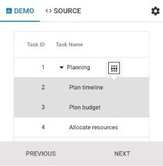

# Selection in Angular Treegrid component

Selection provides an option to highlight a row or cell. Selection can be done through simple Mouse down or Arrow keys. To disable selection in the TreeGrid, set the [`allowSelection`](https://ej2.syncfusion.com/angular/documentation/api/treegrid/#allowselection) to false.

The treegrid supports two types of selection that can be set by using the [`selectionSettings.type`](https://ej2.syncfusion.com/angular/documentation/api/treegrid/selectionSettings/#type).They are:

* **`Single`** - The `Single` value is set by default. Allows you to select only a single row or cell.
* **`Multiple`** - Allows you to select multiple rows or cells.
To perform the multi-selection, press and hold CTRL key and click the desired rows or cells.
To select range of rows or cells, press and hold the SHIFT key and click the rows or cells.












  


## Selection mode

TreeGrid supports three types of selection mode which can be set by using [`selectionSettings.mode`](https://ej2.syncfusion.com/angular/documentation/api/treegrid/selectionSettings/#mode). They are:

* **`Row`** - The `row` value is set by default. Allows you to select rows only.
* **`Cell`** - Allows you to select cells only.
* **`Both`** - Allows you to select rows and cells at the same time.












  


## Toggle selection

The Toggle selection allows to perform selection and unselection of the particular row or cell. To [`enable toggle`](https://ej2.syncfusion.com/angular/documentation/api/treegrid/selectionSettings/#enabletoggle) selection, set enableToggle property of the selectionSettings as true. If you click on the selected row or cell then it will be unselected and vice versa.












  


>If multi selection is enabled, then first click on any selected row (without pressing Ctrl key), it will clear the multi selection and in second click on the same row, it will be unselected.

## Touch interaction

When you tap the tree grid row on touch screen devices, the tapped row is selected.
Also, it will show a popup  for multi-row-selection.
To select multiple rows or cells, tap the popup then tap the desired rows or cells.

> For multi-selection, It requires the selection [`type`](https://ej2.syncfusion.com/angular/documentation/api/treegrid/selectionSettings/#type) to be **Multiple**.

The following screenshot represents a tree grid touch selection in the device.

> Refer to Syncfusion [`Angular Tree Grid`](https://www.syncfusion.com/angular-ui-components/angular-tree-grid) feature tour page for its groundbreaking feature representations. Also, explore Syncfusion [`Angular Tree Grid example`](https://ej2.syncfusion.com/angular/demos/#/material/treegrid/treegrid-overview) to know how to present and manipulate data.